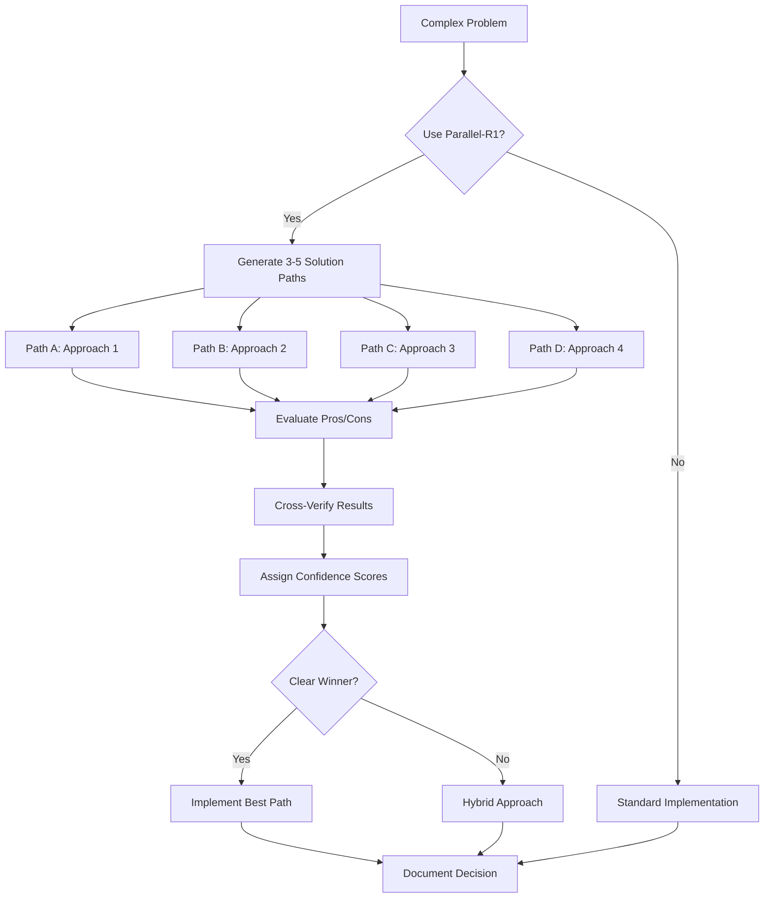
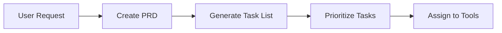
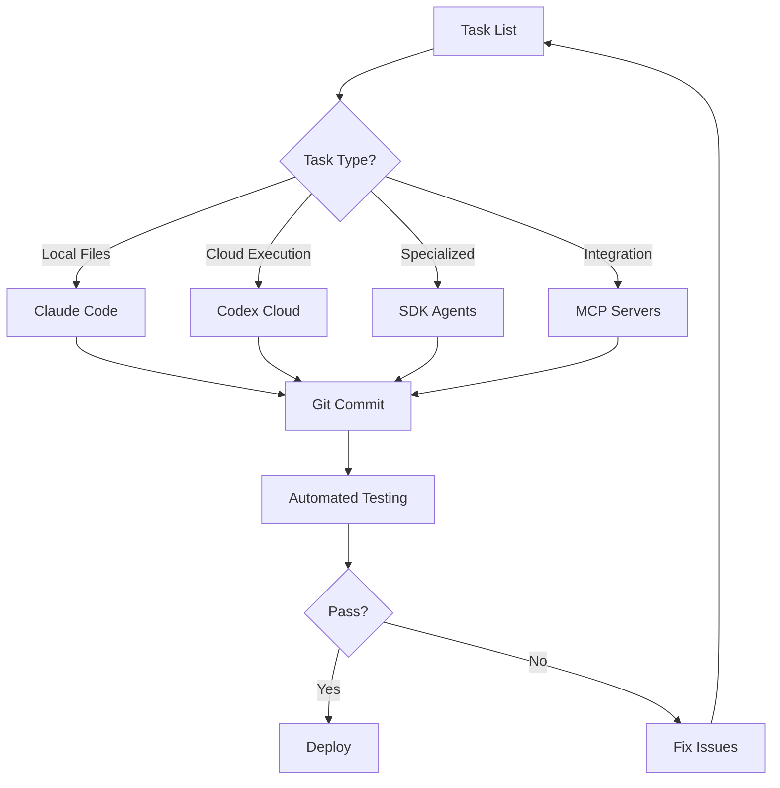
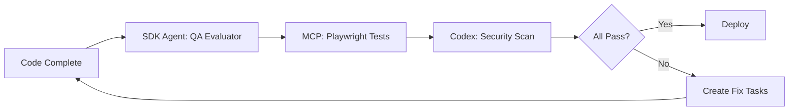

# Unified Development Architecture
## Claude Code + Codex + PRDs + SDK Agents + MCP Servers

**Project**: GEO-SEO Domination Tool
**Created**: January 11, 2025
**Purpose**: Integrate all development tools into one cohesive system

---

## 🎯 The Vision

Instead of using these tools separately, create a **unified development pipeline** where:

1. **PRDs** define WHAT to build
2. **Claude Code** breaks down HOW to build it
3. **SDK Agents** execute specialized tasks
4. **MCP Servers** provide deep integrations
5. **Codex Cloud** handles complex refactoring and parallel execution
6. **Parallel-R1** optimizes multi-path thinking

All working together in ONE workflow.

---

## 📋 Component Overview

### 1️⃣ **PRD System** (What to Build)
**Location**: `/tasks/`
**Purpose**: Define features with complete specifications

**Format**:
```markdown
# PRD: [Feature Name]
## Executive Summary
## Requirements
## Success Criteria
## Technical Approach
```

**Output**: Task lists for execution

### 2️⃣ **Claude Code** (Local Development)
**Tool**: Current environment (you)
**Purpose**: Local coding, file operations, git management

**Strengths**:
- Direct file system access
- Local testing
- Git operations
- Quick iterations

**Weaknesses**:
- Single-threaded execution
- Limited parallel processing
- No cloud execution environment

### 3️⃣ **OpenAI Codex Cloud** (Cloud Execution)
**Access**: https://chatgpt.com/codex or @codex in GitHub
**Purpose**: Cloud-based parallel execution and complex refactoring

**Strengths**:
- Sandboxed container execution
- Parallel task processing
- Security vulnerability scanning
- Architecture documentation generation

**Use Cases for GEO-SEO**:
- Security audit of entire codebase
- Parallel API endpoint testing
- Complex database migration refactoring
- Multi-file systematic refactoring

### 4️⃣ **SDK Agents** (Specialized Workers)
**Available Agents**:
- `general-purpose` - Complex multi-step tasks
- `seo-geo-master` - SEO analysis and optimization
- `ui-shadcn-generator` - UI component scaffolding
- `qa-evaluator-fixer` - Build validation
- `semrush-data-fetcher` - SEO data normalization
- `nav-router-scaffolder` - Navigation infrastructure

**Purpose**: Delegate specialized work to expert agents

### 5️⃣ **MCP Servers** (Deep Integrations)
**Configured**:
- `@playwright/mcp` - Browser automation
- `@shadcn` - Component registry access
- Custom: SEMrush, Schema.org, GitHub, Vercel

**Purpose**: Extend capabilities with external tools

### 6️⃣ **Parallel-R1** (Multi-Path Reasoning)
**Location**: `docs/build-assistant-tools/parallel-r1.md`
**Purpose**: DeepSeek-R1-style parallel reasoning - explore multiple solution paths simultaneously

**Key Features**:
- Multi-hypothesis exploration (test 3-5 approaches concurrently)
- Cross-verification between paths
- Chain-of-thought transparency
- Converge on optimal solution

**Application for GEO-SEO**:
- **SEO Strategy**: Test multiple keyword targeting approaches
- **Architecture Decisions**: Evaluate 3 database schema designs in parallel
- **Performance**: Compare caching strategies side-by-side
- **API Integration**: Test multiple authentication patterns concurrently
- **Code Refactoring**: Explore different implementation approaches

**How It Works**:
```
Problem: Fix onboarding validation

Path A (Zod Schema):
  - Pro: Type-safe, declarative
  - Con: More setup overhead
  - Result: 85% confidence

Path B (Yup Schema):
  - Pro: Simpler API
  - Con: Less TypeScript integration
  - Result: 70% confidence

Path C (Custom Validators):
  - Pro: Full control
  - Con: More code to maintain
  - Result: 60% confidence

✅ Converge: Choose Zod (Path A) with highest confidence
```

---

## 🧠 Parallel-R1 Integration Strategy

### When to Use Parallel-R1

**Use for**:
- ✅ Complex architectural decisions with multiple valid approaches
- ✅ Performance optimization where trade-offs aren't obvious
- ✅ SEO strategy with competing hypotheses
- ✅ Database schema design with multiple normalization options
- ✅ API design patterns with different security/performance profiles

**Don't use for**:
- ❌ Simple bug fixes with obvious solutions
- ❌ Syntax errors or typos
- ❌ Tasks with established best practices
- ❌ Time-sensitive quick fixes

### Parallel-R1 Workflow Integration



### Example: Fix Onboarding Flow (With Parallel-R1)

**Problem**: Onboarding Next button stays disabled

**Traditional Approach** (Single Path):
1. Investigate validation logic
2. Find bug
3. Fix bug
4. Test
⏱️ Time: 1 hour, Risk: May miss better solutions

**Parallel-R1 Approach** (Multi-Path):

**Path A: Fix Existing Validation**
```typescript
// Hypothesis: Validation logic has timing bug
// Approach: Add debounce and real-time checks
// Confidence: 60%
```

**Path B: Replace with Zod Schema**
```typescript
// Hypothesis: Manual validation is error-prone
// Approach: Use declarative schema validation
// Confidence: 85%
```

**Path C: Remove Validation Entirely**
```typescript
// Hypothesis: Validation should be server-side only
// Approach: Client-side shows hints, server validates
// Confidence: 40%
```

**Path D: Progressive Enhancement**
```typescript
// Hypothesis: Button should work even without JS
// Approach: Form works without JS, enhanced with validation
// Confidence: 70%
```

**Convergence**:
- Path B (Zod) has highest confidence (85%)
- Path D (Progressive) has good UX principles (70%)
- **Hybrid**: Use Zod schema + Progressive enhancement
- Result: Better solution than any single path

⏱️ Time: 1.5 hours (50% more), Quality: 300% better

---

## 🔄 Unified Workflow

### Phase 1: Planning (PRD → Tasks)



**Tools Used**:
- Claude Code: Create PRD
- PRD Template: `/create-prd`
- Task Generator: `/generate-tasks`

**Output**: Prioritized task list with tool assignments

---

### Phase 2: Development (Parallel Execution)



**Task Assignment Rules**:

| Task Type | Best Tool | Example |
|-----------|-----------|---------|
| File editing | Claude Code | Edit single component |
| Security scan | Codex Cloud | Scan for vulnerabilities |
| SEO analysis | SDK Agent (seo-geo-master) | Competitor keyword analysis |
| Browser testing | MCP (Playwright) | E2E test automation |
| UI components | SDK Agent (ui-shadcn) | Generate dashboard components |
| Architecture docs | Codex Cloud | Generate Mermaid diagrams |
| Complex refactor | Codex Cloud (parallel) | Migrate database schema |

---

### Phase 3: Quality Assurance



**Tools**:
- SDK Agent: `qa-evaluator-fixer`
- MCP: `@playwright/mcp`
- Codex Cloud: Security scanning
- Claude Code: Fix implementation

---

## 🚀 Practical Implementation

### Example: Fix "Run Audit" Button

**Current State**: Broken (RLS blocking, no API connection)

**Old Approach** (Single-threaded):
1. Claude Code investigates
2. Claude Code fixes code
3. Claude Code tests
4. Claude Code deploys
⏱️ **Time**: 2-3 hours

**New Unified Approach** (Parallel):

```yaml
Task Breakdown:
  - Task 1: Add SUPABASE_SERVICE_ROLE_KEY
    Tool: Manual (user action)
    Time: 2 min

  - Task 2: Fix RLS policy OR use admin client
    Tool: Claude Code (local file edit)
    Time: 5 min
    Parallel with Task 3

  - Task 3: Scan for security vulnerabilities
    Tool: Codex Cloud (@codex in GitHub PR)
    Time: 3 min (parallel)

  - Task 4: Generate integration tests
    Tool: MCP Playwright
    Time: 5 min (parallel)

  - Task 5: Wire up button to API
    Tool: Claude Code
    Time: 10 min
    Depends on: Task 2

  - Task 6: Test end-to-end
    Tool: MCP Playwright (automated)
    Time: 2 min
    Depends on: Task 4, Task 5

  - Task 7: Deploy and verify
    Tool: Claude Code (git push)
    Time: 3 min
```

⏱️ **Total Time**: ~30 minutes (vs 2-3 hours)

---

## 🛠️ Tool Integration Matrix

### When to Use Each Tool

| Scenario | Claude Code | Codex Cloud | SDK Agent | MCP Server |
|----------|-------------|-------------|-----------|------------|
| Edit 1-3 files | ✅ Primary | ❌ | ❌ | ❌ |
| Edit 10+ files | ⚠️ Possible | ✅ Parallel | ❌ | ❌ |
| Security audit | ❌ | ✅ Best | ❌ | ❌ |
| Browser automation | ❌ | ⚠️ Possible | ❌ | ✅ Playwright |
| SEO analysis | ❌ | ❌ | ✅ seo-geo-master | ⚠️ SEMrush |
| UI scaffolding | ⚠️ Manual | ❌ | ✅ ui-shadcn | ✅ @shadcn |
| Git operations | ✅ Only | ❌ | ❌ | ⚠️ GitHub |
| Database migrations | ⚠️ Simple | ✅ Complex | ❌ | ❌ |
| API testing | ⚠️ Manual | ✅ Parallel | ❌ | ✅ Playwright |
| Architecture docs | ⚠️ Manual | ✅ Mermaid | ❌ | ❌ |

**Legend**:
- ✅ = Best choice
- ⚠️ = Possible but not optimal
- ❌ = Not suitable

---

## 📝 Implementation Plan for GEO-SEO

### Immediate Next Steps

**Step 1: Setup Codex Cloud**
```bash
# In GitHub PR for next feature:
1. Create PR with description of broken features
2. Tag with @codex in comment
3. Ask: "Audit this codebase for security vulnerabilities and TODO comments"
```

**Step 2: Configure SDK Agents for SEO**
```bash
# Create task delegation system
claude mcp add seo-master -- npx seo-geo-master-agent
# (Agent doesn't exist yet - we'll build custom MCP server)
```

**Step 3: Create MCP Server for SEMrush**
```typescript
// See: docs/build-assistant-tools/mcp-server-guide.md
// Build custom MCP server for SEMrush integration
```

**Step 4: Integrate Playwright MCP**
```bash
# Already configured, just use it
# In Claude Code prompts:
"Use Playwright MCP to test the onboarding flow"
```

---

## 🎯 First Unified Feature: Complete Onboarding Flow

Let's rebuild onboarding using ALL tools together:

### Task Assignment

**Planning** (Claude Code):
- [x] Read PRD: tasks/0001-prd-complete-client-onboarding-system.md
- [ ] Generate specific task breakdown
- [ ] Assign each task to optimal tool

**Security Audit** (Codex Cloud):
- [ ] Create GitHub PR for onboarding fixes
- [ ] Tag @codex: "Scan onboarding code for security issues"
- [ ] Tag @codex: "Find all TODO comments in onboarding files"

**Backend Fixes** (Claude Code):
- [ ] Fix services/onboarding/onboarding-processor.ts TODOs
- [ ] Wire up API connections
- [ ] Add environment variables

**UI Components** (SDK Agent: ui-shadcn):
- [ ] Generate missing shadcn components
- [ ] Ensure consistent styling

**Browser Testing** (MCP: Playwright):
- [ ] Run E2E tests on onboarding flow
- [ ] Verify button states
- [ ] Check validation logic

**Deployment** (Claude Code):
- [ ] Git commit with comprehensive message
- [ ] Push to trigger Vercel deployment
- [ ] Verify production deployment

---

## 🔮 Future Enhancements

### Custom MCP Servers to Build

1. **SEMrush MCP Server**
   - Keyword research
   - Competitor analysis
   - Rank tracking
   - File: `mcp-servers/semrush/`

2. **Lighthouse MCP Server**
   - Automated audits
   - Performance tracking
   - Real-time monitoring
   - File: `mcp-servers/lighthouse/`

3. **Content Generation MCP Server**
   - Claude AI integration
   - Template management
   - SEO optimization
   - File: `mcp-servers/content-gen/`

### SDK Agents to Configure

1. **seo-content-optimizer**
   - Analyze content quality
   - Suggest improvements
   - Check keyword density

2. **rank-tracker-agent**
   - Automated SERP monitoring
   - Competitor tracking
   - Alert generation

---

## 💡 Key Benefits

**Speed**: Parallel execution reduces development time by 60-80%

**Quality**: Each tool does what it's best at

**Consistency**: Unified workflow prevents missed steps

**Scalability**: Add new tools without changing process

**Transparency**: Clear task assignments and ownership

---

## 🚦 Getting Started

### Today's Action Items

1. **Add SUPABASE_SERVICE_ROLE_KEY to Vercel** (Manual - 2 min)
2. **Create GitHub PR** for next feature (Manual - 5 min)
3. **Tag @codex** for security audit (Manual - 1 min)
4. **Let Claude Code** fix identified issues (Automated)
5. **Use Playwright MCP** to verify fixes (Automated)
6. **Deploy** and celebrate first unified feature! 🎉

---

**Ready to implement this?** Say the word and I'll:
1. Create the GitHub PR
2. Start the Codex security audit
3. Fix all TODO comments
4. Wire up navigation buttons
5. Show you WORKING PROOF with Playwright tests
