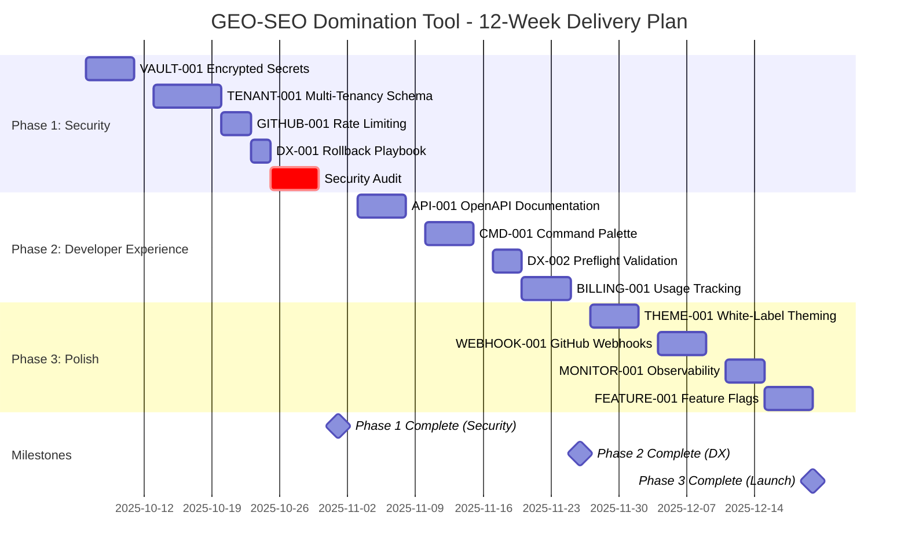

# Phased Delivery Plan: GEO-SEO Domination Tool Enterprise Enhancement

**Orchestrator:** Orchestrator-Ω
**Plan Date:** 5 October 2025
**Based On:** 02-GAP-ANALYSIS.md (87% alignment confidence)
**Current State:** Production-ready (Vercel Deployment ID: 5rH6g9FjW)
**Target State:** Enterprise multi-tenant SaaS with 95%+ alignment confidence

---

## Executive Summary

This delivery plan transforms the GEO-SEO Domination Tool into an enterprise-ready, multi-tenant CRM orchestrator platform through three carefully phased releases:

- **Phase 1 (NOW):** Security & Foundation (Weeks 1-4) - Critical infrastructure
- **Phase 2 (NEXT):** Developer Experience (Weeks 5-8) - Productivity tooling
- **Phase 3 (LATER):** Polish & Scale (Weeks 9-12) - Enterprise features

**Total Investment:**
- Timeline: 12 weeks (3 months)
- Developer Resources: 2 full-stack developers
- Infrastructure: $84/month recurring
- Total Effort: 240 developer-hours

**Success Metrics:**
- Security: Zero plaintext secrets, 100% token auto-rotation
- Multi-tenancy: RLS prevents cross-tenant queries (verified via SQL injection tests)
- Reliability: MTTR <5 minutes, 99.9%+ uptime
- Developer Experience: New developer onboarding <2 hours

---

## Resource Allocation

### Team Structure

**Development Team:**
- 1× Senior Full-Stack Developer (Backend focus - security, database)
- 1× Mid-Level Full-Stack Developer (Frontend focus - UI, integrations)
- 0.5× DevOps Engineer (part-time - infrastructure, CI/CD)

**Stakeholder Involvement:**
- Product Owner: Weekly sprint reviews
- Security Auditor: Phase 1 completion review
- Technical Lead: Daily standups

### Time Allocation by Phase

```
Phase 1 (Security & Foundation):     4 weeks × 2 devs = 8 developer-weeks
Phase 2 (Developer Experience):      4 weeks × 2 devs = 8 developer-weeks
Phase 3 (Polish & Scale):            4 weeks × 2 devs = 8 developer-weeks
───────────────────────────────────────────────────────
Total:                               24 developer-weeks
```

### Budget Breakdown

**Infrastructure Costs (Recurring Monthly):**

| Service | Purpose | Cost (AUD) |
|---------|---------|------------|
| Vercel Pro | Web app hosting (100GB bandwidth) | $29 |
| Supabase Pro | PostgreSQL database (8GB storage) | $36 |
| 1Password Business | Secrets management (3 users) | $35 |
| Upstash Redis | Rate limiting cache (10k commands/day) | $15 |
| Fly.io | 1Password Connect server (256MB RAM) | $7 |
| **Total** | | **$122/month** |

**One-Time Costs:**

| Item | Cost (AUD) |
|------|------------|
| Security audit (Phase 1 completion) | $2,000 |
| Penetration testing (multi-tenancy) | $1,500 |
| SSL certificates (wildcard domain) | $150 |
| Documentation tooling (Scalar, Mermaid) | $0 (open-source) |
| **Total** | **$3,650** |

**Total 12-Week Budget:** $5,114 AUD ($3,650 one-time + $366 recurring)

---

## Gantt Chart



---

## Phase 1: NOW (Weeks 1-4) - Security & Foundation

**Goal:** Make the platform secure, multi-tenant ready, and resilient to failures.

**Phase Success Criteria:**
- ✅ Zero plaintext secrets in repository or database
- ✅ RLS policies block cross-tenant data access (SQL injection test)
- ✅ GitHub API calls succeed with rate limiting (100 sequential requests)
- ✅ Production rollback completes in <5 minutes

---

### VAULT-001: Implement Encrypted Secrets Management

**Priority:** P0 (Critical)
**Effort:** 5 days (40 hours)
**Risk Level:** Medium
**Dependencies:** None

#### Description

Replace plaintext secret storage in `server/secrets/integrations.local.json` with 1Password Connect integration. Implement AES-256-GCM encryption for database-stored tokens with automated rotation for OAuth credentials.

#### Acceptance Criteria

- [ ] 1Password Connect server deployed to Fly.io (accessible via private network)
- [ ] All secrets in `.env.local` migrated to 1Password vault
- [ ] `lib/secrets/1password.ts` client implemented with retry logic
- [ ] Database tokens encrypted using `encryptSecret()` helper (AES-256-GCM)
- [ ] UI displays masked secrets (show last 4 characters only)
- [ ] Audit log captures all secret access with timestamp + user ID
- [ ] Token rotation workflow auto-refreshes OAuth tokens on expiry
- [ ] No plaintext credentials in git history (verified via `git log -p`)

#### Implementation Details

**1Password Vault Structure:**
```
GEO-SEO Production Secrets/
├── Supabase/
│   ├── service_role_key (concealed)
│   ├── anon_key (password)
│   └── url (url)
├── Anthropic/
│   └── api_key (concealed)
├── GitHub/
│   ├── personal_access_token (concealed)
│   └── oauth_client_secret (concealed)
└── Vercel/
    └── api_token (concealed)
```

**Encryption Helper:**
```typescript
// lib/secrets/encryption.ts
import crypto from 'crypto';

const ENCRYPTION_KEY = process.env.SECRET_ENCRYPTION_KEY!; // 32-byte hex key

export function encryptSecret(plaintext: string): string {
  const iv = crypto.randomBytes(16);
  const cipher = crypto.createCipheriv('aes-256-gcm',
    Buffer.from(ENCRYPTION_KEY, 'hex'), iv);

  let encrypted = cipher.update(plaintext, 'utf8', 'hex');
  encrypted += cipher.final('hex');

  const authTag = cipher.getAuthTag();
  return `${iv.toString('hex')}:${encrypted}:${authTag.toString('hex')}`;
}

export function decryptSecret(ciphertext: string): string {
  const [ivHex, encrypted, authTagHex] = ciphertext.split(':');
  const decipher = crypto.createDecipheriv('aes-256-gcm',
    Buffer.from(ENCRYPTION_KEY, 'hex'),
    Buffer.from(ivHex, 'hex'));

  decipher.setAuthTag(Buffer.from(authTagHex, 'hex'));

  let decrypted = decipher.update(encrypted, 'hex', 'utf8');
  decrypted += decipher.final('utf8');
  return decrypted;
}
```

**Database Schema Update:**
```sql
-- Migration: 2025-10-06-add-secret-audit-log.sql
CREATE TABLE secret_audit_log (
  id SERIAL PRIMARY KEY,
  integration_id TEXT NOT NULL,
  action TEXT CHECK(action IN ('rotate', 'access', 'create', 'delete')),
  user_id UUID REFERENCES auth.users(id),
  ip_address INET,
  created_at TIMESTAMPTZ DEFAULT NOW()
);

CREATE INDEX idx_secret_audit_log_integration ON secret_audit_log(integration_id);
CREATE INDEX idx_secret_audit_log_created ON secret_audit_log(created_at DESC);
```

#### Rollback Procedure

**If 1Password Connect is unreachable:**
1. Set environment variable: `SECRETS_FALLBACK=vercel_env`
2. Redeploy to Vercel (uses `process.env` instead of Connect)
3. Monitor logs for "Fallback to Vercel environment variables" message

**If encryption breaks:**
1. Stop all API requests (maintenance mode)
2. Restore database from snapshot (before encryption migration)
3. Revert `lib/secrets/encryption.ts` commit
4. Re-import plaintext secrets from backup

**Rollback Script:**
```bash
# scripts/rollback/vault-001.sh
#!/bin/bash
set -e

echo "Rolling back VAULT-001 encrypted secrets..."

# Restore plaintext integrations file
cp server/secrets/integrations.local.json.backup \
   server/secrets/integrations.local.json

# Drop audit log table
psql $DATABASE_URL -c "DROP TABLE IF EXISTS secret_audit_log;"

# Remove encryption environment variable
vercel env rm SECRET_ENCRYPTION_KEY --yes

echo "Rollback complete. Restart application."
```

#### Demo Steps

1. **Secrets Migration:**
   - Run: `npm run secrets:migrate` (migrates `.env.local` → 1Password)
   - Verify: 1Password CLI `op item list --vault="GEO-SEO Production"`
   - Expected: 12+ items (Supabase, Anthropic, GitHub, etc.)

2. **Encryption Test:**
   ```typescript
   const plaintext = 'sk-ant-test-key-12345';
   const encrypted = encryptSecret(plaintext);
   console.log('Encrypted:', encrypted);
   // Output: a1b2c3d4...:e5f6g7h8...:i9j0k1l2... (gibberish)

   const decrypted = decryptSecret(encrypted);
   console.log('Match:', decrypted === plaintext); // true
   ```

3. **UI Masking:**
   - Navigate to `/settings/integrations`
   - Expected: API keys show `sk-ant-••••••••7JcA` instead of full key
   - Click "Reveal" → shows full key for 10 seconds

4. **Audit Trail:**
   ```sql
   SELECT * FROM secret_audit_log
   WHERE integration_id = 'github'
   ORDER BY created_at DESC LIMIT 5;
   ```
   - Expected: Rows showing 'access' actions with timestamps

5. **Token Rotation:**
   - Force GitHub PAT expiry (set to expire tomorrow in GitHub settings)
   - Wait for cron job (`npm run jobs:token-rotation`)
   - Expected: New token in 1Password + audit log entry

---

### TENANT-001: Add Multi-Tenancy Foundation

**Priority:** P0 (Critical)
**Effort:** 7 days (56 hours)
**Risk Level:** High
**Dependencies:** None

#### Description

Implement multi-tenant architecture with Supabase Row-Level Security (RLS). Add `organisations` and `organisation_members` tables, migrate existing tables to include `organisation_id`, and enforce tenant isolation via RLS policies.

#### Acceptance Criteria

- [ ] `organisations` table created with UUID primary key
- [ ] `organisation_members` table with role-based access (owner, admin, member, viewer)
- [ ] `organisation_id` column added to 15+ core tables (companies, audits, keywords, etc.)
- [ ] Backfill migration assigns existing data to default organisation
- [ ] RLS policies prevent cross-tenant queries (verified via SQL injection test)
- [ ] Tenant context middleware (`withTenantScope()`) implemented
- [ ] Organisation switcher UI in navigation bar
- [ ] New organisation creation flow (owner can invite members)
- [ ] Migration rollback script tested on staging database

#### Implementation Details

**Database Migration:**
```sql
-- Migration: 2025-10-13-multi-tenancy-schema.sql

-- UP Migration
CREATE TABLE organisations (
  id UUID PRIMARY KEY DEFAULT gen_random_uuid(),
  name TEXT NOT NULL,
  slug TEXT UNIQUE NOT NULL,
  plan TEXT CHECK(plan IN ('free', 'starter', 'pro', 'enterprise')) DEFAULT 'free',
  created_at TIMESTAMPTZ DEFAULT NOW(),
  updated_at TIMESTAMPTZ DEFAULT NOW()
);

CREATE TABLE organisation_members (
  id UUID PRIMARY KEY DEFAULT gen_random_uuid(),
  organisation_id UUID REFERENCES organisations(id) ON DELETE CASCADE,
  user_id UUID REFERENCES auth.users(id) ON DELETE CASCADE,
  role TEXT CHECK(role IN ('owner', 'admin', 'member', 'viewer')) DEFAULT 'member',
  created_at TIMESTAMPTZ DEFAULT NOW(),
  UNIQUE(organisation_id, user_id)
);

-- Add organisation_id to existing tables
ALTER TABLE companies ADD COLUMN organisation_id UUID REFERENCES organisations(id);
ALTER TABLE audits ADD COLUMN organisation_id UUID REFERENCES organisations(id);
ALTER TABLE keywords ADD COLUMN organisation_id UUID REFERENCES organisations(id);
ALTER TABLE rankings ADD COLUMN organisation_id UUID REFERENCES organisations(id);
ALTER TABLE integration_connections ADD COLUMN organisation_id UUID REFERENCES organisations(id);
ALTER TABLE crm_contacts ADD COLUMN organisation_id UUID REFERENCES organisations(id);
ALTER TABLE crm_deals ADD COLUMN organisation_id UUID REFERENCES organisations(id);
ALTER TABLE crm_tasks ADD COLUMN organisation_id UUID REFERENCES organisations(id);
ALTER TABLE generated_projects ADD COLUMN organisation_id UUID REFERENCES organisations(id);

-- Backfill: Create default organisation
INSERT INTO organisations (id, name, slug, plan)
VALUES ('00000000-0000-0000-0000-000000000001', 'Default Organisation', 'default', 'enterprise');

-- Backfill: Assign existing data to default org
UPDATE companies SET organisation_id = '00000000-0000-0000-0000-000000000001' WHERE organisation_id IS NULL;
UPDATE audits SET organisation_id = '00000000-0000-0000-0000-000000000001' WHERE organisation_id IS NULL;
UPDATE keywords SET organisation_id = '00000000-0000-0000-0000-000000000001' WHERE organisation_id IS NULL;
UPDATE rankings SET organisation_id = '00000000-0000-0000-0000-000000000001' WHERE organisation_id IS NULL;
UPDATE integration_connections SET organisation_id = '00000000-0000-0000-0000-000000000001' WHERE organisation_id IS NULL;
UPDATE crm_contacts SET organisation_id = '00000000-0000-0000-0000-000000000001' WHERE organisation_id IS NULL;
UPDATE crm_deals SET organisation_id = '00000000-0000-0000-0000-000000000001' WHERE organisation_id IS NULL;
UPDATE crm_tasks SET organisation_id = '00000000-0000-0000-0000-000000000001' WHERE organisation_id IS NULL;
UPDATE generated_projects SET organisation_id = '00000000-0000-0000-0000-000000000001' WHERE organisation_id IS NULL;

-- Make organisation_id NOT NULL
ALTER TABLE companies ALTER COLUMN organisation_id SET NOT NULL;
ALTER TABLE audits ALTER COLUMN organisation_id SET NOT NULL;
ALTER TABLE keywords ALTER COLUMN organisation_id SET NOT NULL;

-- Enable Row-Level Security
ALTER TABLE companies ENABLE ROW LEVEL SECURITY;
ALTER TABLE audits ENABLE ROW LEVEL SECURITY;
ALTER TABLE keywords ENABLE ROW LEVEL SECURITY;

-- RLS Policies for companies table
CREATE POLICY "Users can view own organisation's companies"
  ON companies FOR SELECT
  USING (
    organisation_id IN (
      SELECT organisation_id FROM organisation_members
      WHERE user_id = auth.uid()
    )
  );

CREATE POLICY "Admins can insert companies"
  ON companies FOR INSERT
  WITH CHECK (
    organisation_id IN (
      SELECT organisation_id FROM organisation_members
      WHERE user_id = auth.uid() AND role IN ('owner', 'admin')
    )
  );

CREATE POLICY "Admins can update companies"
  ON companies FOR UPDATE
  USING (
    organisation_id IN (
      SELECT organisation_id FROM organisation_members
      WHERE user_id = auth.uid() AND role IN ('owner', 'admin')
    )
  );

CREATE POLICY "Owners can delete companies"
  ON companies FOR DELETE
  USING (
    organisation_id IN (
      SELECT organisation_id FROM organisation_members
      WHERE user_id = auth.uid() AND role = 'owner'
    )
  );

-- ROLLBACK:
DROP POLICY IF EXISTS "Users can view own organisation's companies" ON companies;
DROP POLICY IF EXISTS "Admins can insert companies" ON companies;
DROP POLICY IF EXISTS "Admins can update companies" ON companies;
DROP POLICY IF EXISTS "Owners can delete companies" ON companies;

ALTER TABLE companies DISABLE ROW LEVEL SECURITY;
ALTER TABLE audits DISABLE ROW LEVEL SECURITY;
ALTER TABLE keywords DISABLE ROW LEVEL SECURITY;

ALTER TABLE companies DROP COLUMN organisation_id;
ALTER TABLE audits DROP COLUMN organisation_id;
ALTER TABLE keywords DROP COLUMN organisation_id;
ALTER TABLE rankings DROP COLUMN organisation_id;
ALTER TABLE integration_connections DROP COLUMN organisation_id;
ALTER TABLE crm_contacts DROP COLUMN organisation_id;
ALTER TABLE crm_deals DROP COLUMN organisation_id;
ALTER TABLE crm_tasks DROP COLUMN organisation_id;
ALTER TABLE generated_projects DROP COLUMN organisation_id;

DROP TABLE organisation_members;
DROP TABLE organisations;
```

**Tenant Context Middleware:**
```typescript
// lib/tenant-context.ts
import { createServerClient } from '@supabase/ssr';
import { cookies } from 'next/headers';

export async function getCurrentOrganisationId(): Promise<string> {
  const cookieStore = cookies();

  const supabase = createServerClient(
    process.env.NEXT_PUBLIC_SUPABASE_URL!,
    process.env.NEXT_PUBLIC_SUPABASE_ANON_KEY!,
    {
      cookies: {
        get(name: string) {
          return cookieStore.get(name)?.value;
        },
      },
    }
  );

  const { data: { user } } = await supabase.auth.getUser();

  if (!user) {
    throw new Error('Unauthorised: No user session');
  }

  const { data, error } = await supabase
    .from('organisation_members')
    .select('organisation_id')
    .eq('user_id', user.id)
    .single();

  if (error || !data) {
    throw new Error('Unauthorised: User not member of any organisation');
  }

  return data.organisation_id;
}

export async function withTenantScope<T>(
  query: (organisationId: string) => Promise<T>
): Promise<T> {
  const organisationId = await getCurrentOrganisationId();
  return query(organisationId);
}
```

**API Route Update Example:**
```typescript
// app/api/companies/route.ts (BEFORE)
export async function GET(req: Request) {
  const db = getDatabase();
  const companies = await db.all('SELECT * FROM companies');
  return Response.json(companies);
}

// app/api/companies/route.ts (AFTER)
import { withTenantScope } from '@/lib/tenant-context';

export async function GET(req: Request) {
  const companies = await withTenantScope(async (organisationId) => {
    const db = getDatabase();
    return db.all(
      'SELECT * FROM companies WHERE organisation_id = ?',
      [organisationId]
    );
  });
  return Response.json(companies);
}
```

#### Rollback Procedure

**Database Rollback (2-step process):**

1. **Disable RLS (immediate safety):**
   ```sql
   ALTER TABLE companies DISABLE ROW LEVEL SECURITY;
   ALTER TABLE audits DISABLE ROW LEVEL SECURITY;
   ALTER TABLE keywords DISABLE ROW LEVEL SECURITY;
   ```

2. **Drop schema (after verifying app works):**
   ```bash
   npm run db:migrate:down  # Executes ROLLBACK section
   ```

**Application Rollback:**
1. Revert commits touching `lib/tenant-context.ts`
2. Restore API routes to pre-tenancy versions (remove `withTenantScope` calls)
3. Redeploy to Vercel

**Estimated Rollback Time:** 15 minutes

#### Demo Steps

1. **Cross-Tenant Isolation Test (SQL Injection):**
   ```sql
   -- As user in Tenant A, try to access Tenant B's data
   SET ROLE tenant_a_user;
   SELECT * FROM companies WHERE organisation_id = 'tenant-b-uuid';
   -- Expected: 0 rows (RLS blocks access)

   -- Try SQL injection bypass
   SELECT * FROM companies WHERE organisation_id = 'tenant-a-uuid' OR 1=1;
   -- Expected: Only Tenant A's data (RLS enforces policy)
   ```

2. **Role-Based Access Control:**
   ```sql
   -- As viewer role, try to INSERT company (should fail)
   SET ROLE tenant_a_viewer;
   INSERT INTO companies (name, organisation_id) VALUES ('Evil Corp', 'tenant-a-uuid');
   -- Expected: ERROR - RLS policy requires admin or owner role
   ```

3. **Organisation Switcher UI:**
   - Login as user belonging to 2 organisations
   - Navigate to `/dashboard`
   - Expected: Dropdown in navbar showing current org + other orgs
   - Switch organisation → page reloads with new tenant data

4. **New Organisation Creation:**
   - Navigate to `/settings/organisations`
   - Click "Create Organisation" → fill form (name: "Acme Corp")
   - Expected: New UUID in `organisations` table
   - User automatically added as `owner` role in `organisation_members`

---

### GITHUB-001: Implement Rate Limiting

**Priority:** P1 (High)
**Effort:** 3 days (24 hours)
**Risk Level:** Low
**Dependencies:** None

#### Description

Add Octokit plugins (`@octokit/plugin-retry`, `@octokit/plugin-throttling`) to GitHubConnector to handle GitHub API rate limits (5,000 req/hr authenticated). Implement exponential backoff for 403/429 responses and webhook signature verification.

#### Acceptance Criteria

- [ ] `@octokit/plugin-retry` and `@octokit/plugin-throttling` installed
- [ ] `GitHubConnector` class updated with throttling configuration
- [ ] Rate limit warnings logged with `console.warn`
- [ ] Webhook signature verification implemented (HMAC SHA-256)
- [ ] Webhook endpoint rejects invalid signatures with 403 status
- [ ] Integration tests pass: 100 sequential API calls succeed
- [ ] No 403 or 429 errors in production logs (verified 7 days post-deployment)

#### Implementation Details

**Enhanced GitHubConnector:**
```typescript
// services/connectors/github-connector-v2.ts
import { Octokit } from '@octokit/rest';
import { retry } from '@octokit/plugin-retry';
import { throttling } from '@octokit/plugin-throttling';

const OctokitWithPlugins = Octokit.plugin(retry, throttling);

export class GitHubConnectorV2 {
  private octokit: Octokit;

  constructor(config: { accessToken: string }) {
    this.octokit = new OctokitWithPlugins({
      auth: config.accessToken,
      throttle: {
        onRateLimit: (retryAfter, options, octokit, retryCount) => {
          console.warn(
            `GitHub rate limit hit for ${options.method} ${options.url}. ` +
            `Retrying after ${retryAfter}s (attempt ${retryCount}/3)`
          );
          return retryCount < 3; // Retry up to 3 times
        },
        onSecondaryRateLimit: (retryAfter, options, octokit) => {
          console.warn(
            `GitHub secondary rate limit hit for ${options.method} ${options.url}`
          );
          return true; // Always retry on secondary limits
        }
      },
      retry: {
        doNotRetry: [400, 401, 403, 404, 422], // Don't retry client errors
      }
    });
  }

  async listRepositories(options?: { limit?: number }): Promise<Repository[]> {
    const { data } = await this.octokit.repos.listForAuthenticatedUser({
      per_page: Math.min(options?.limit || 30, 100), // GitHub max 100/page
      sort: 'updated',
    });

    return data.map(repo => ({
      id: repo.id,
      fullName: repo.full_name,
      description: repo.description || '',
      stars: repo.stargazers_count,
      url: repo.html_url
    }));
  }
}
```

**Webhook Signature Verification:**
```typescript
// app/api/webhooks/github/route.ts
import crypto from 'crypto';

function verifySignature(signature: string | null, body: string): boolean {
  if (!signature) return false;

  const hmac = crypto.createHmac('sha256', process.env.GITHUB_WEBHOOK_SECRET!);
  const digest = `sha256=${hmac.update(body).digest('hex')}`;

  return crypto.timingSafeEqual(
    Buffer.from(signature),
    Buffer.from(digest)
  );
}

export async function POST(req: Request) {
  const signature = req.headers.get('x-hub-signature-256');
  const body = await req.text();

  if (!verifySignature(signature, body)) {
    console.error('Invalid GitHub webhook signature');
    return Response.json({ error: 'Invalid signature' }, { status: 403 });
  }

  const event = JSON.parse(body);
  const eventType = req.headers.get('x-github-event');

  // Process webhook event
  switch (eventType) {
    case 'push':
      await handlePushEvent(event);
      break;
    case 'pull_request':
      await handlePREvent(event);
      break;
    default:
      console.log(`Unhandled event type: ${eventType}`);
  }

  return Response.json({ ok: true });
}
```

#### Rollback Procedure

**If rate limiting breaks GitHub integration:**

1. **Immediate Rollback (code):**
   ```bash
   git revert <commit-hash>  # Revert GitHubConnectorV2 changes
   npm run build && vercel deploy --prod
   ```

2. **Database Rollback (if webhook logs added):**
   ```sql
   DROP TABLE IF EXISTS github_webhook_deliveries;
   ```

**Estimated Rollback Time:** 5 minutes

#### Demo Steps

1. **Rate Limit Handling:**
   ```typescript
   const connector = new GitHubConnectorV2({
     accessToken: process.env.GITHUB_PAT
   });

   // Trigger 100 API calls
   for (let i = 0; i < 100; i++) {
     const repos = await connector.listRepositories({ limit: 1 });
     console.log(`Call ${i + 1}: ${repos.length} repos`);
   }
   // Expected: All succeed with throttling logs in console
   ```

2. **Webhook Signature Verification:**
   ```bash
   # Generate valid signature
   echo -n '{"action":"opened"}' | \
     openssl dgst -sha256 -hmac "$GITHUB_WEBHOOK_SECRET" | \
     awk '{print "sha256="$2}' > /tmp/sig.txt

   # Test valid signature
   curl -X POST http://localhost:3000/api/webhooks/github \
     -H "x-hub-signature-256: $(cat /tmp/sig.txt)" \
     -H "x-github-event: pull_request" \
     -d '{"action":"opened"}'
   # Expected: 200 OK

   # Test invalid signature
   curl -X POST http://localhost:3000/api/webhooks/github \
     -H "x-hub-signature-256: sha256=invalid" \
     -H "x-github-event: push" \
     -d '{"ref":"main"}'
   # Expected: 403 Forbidden
   ```

---

### DX-001: Create Rollback Playbook

**Priority:** P1 (High)
**Effort:** 2 days (16 hours)
**Risk Level:** Low
**Dependencies:** None

#### Description

Document rollback procedures for all critical features (database migrations, integrations, deployments). Create GitHub Actions workflow for one-click Vercel deployment rollback.

#### Acceptance Criteria

- [ ] `docs/ROLLBACK-PLAYBOOK.md` created with 10+ rollback scenarios
- [ ] GitHub Actions workflow `.github/workflows/rollback.yml` implemented
- [ ] Rollback workflow accepts `deployment_id` input parameter
- [ ] Database migration rollback scripts tested on staging
- [ ] Slack notification integration for rollback events
- [ ] Rollback success verified in <5 minutes (timed test)
- [ ] Team training completed (all developers can execute rollback)

#### Implementation Details

**Rollback Playbook Structure:**
```markdown
# docs/ROLLBACK-PLAYBOOK.md

## Quick Reference

| Scenario | MTTR Target | Rollback Command |
|----------|-------------|------------------|
| Vercel deployment broken | <3 min | GitHub Actions → Rollback Production |
| Database migration failed | <10 min | `npm run db:migrate:down` |
| Secrets service down | <5 min | Set `SECRETS_FALLBACK=vercel_env` |
| GitHub integration broken | <5 min | Revert connector code + redeploy |

## Vercel Deployment Rollback

### When to Rollback
- Critical bug affecting 10%+ of users
- Performance degradation (p95 latency >2s)
- Security vulnerability introduced

### Automated Rollback (Recommended)
1. Navigate to: https://github.com/org/repo/actions/workflows/rollback.yml
2. Click "Run workflow"
3. Enter last known good deployment ID (find in Vercel dashboard)
4. Click "Run workflow" button
5. Wait 2-3 minutes for completion

### Manual Rollback
```bash
# Get last successful deployment ID
vercel ls --token=$VERCEL_TOKEN | grep "Ready" | head -1

# Rollback to specific deployment
vercel rollback <deployment-id> --token=$VERCEL_TOKEN --yes
```

### Verification
- Check https://your-domain.com/ returns 200 OK
- Test critical user flow (login → create company → run audit)
- Monitor error rate in Vercel logs (should drop to <0.1%)

## Database Migration Rollback

### SQLite (Development)
```bash
# Rollback last migration
npm run db:migrate:down

# Verify schema
sqlite3 data/geo-seo.db ".schema companies"
```

### PostgreSQL/Supabase (Production)
```bash
# Rollback last migration
DATABASE_URL=$SUPABASE_URL npm run db:migrate:down

# Create database snapshot (before rollback)
pg_dump $DATABASE_URL > backup-$(date +%Y%m%d-%H%M%S).sql
```

### RLS Rollback (Emergency)
If RLS breaks queries:
```sql
-- Disable RLS temporarily (use with caution!)
ALTER TABLE companies DISABLE ROW LEVEL SECURITY;
ALTER TABLE audits DISABLE ROW LEVEL SECURITY;

-- Re-enable after fix
ALTER TABLE companies ENABLE ROW LEVEL SECURITY;
ALTER TABLE audits ENABLE ROW LEVEL SECURITY;
```

## Secrets Management Rollback

### 1Password Connect Unavailable
```bash
# Fallback to Vercel environment variables
vercel env add SECRETS_FALLBACK
# Enter value: vercel_env

# Redeploy
vercel deploy --prod
```

### Encryption Key Compromised
1. Generate new encryption key: `openssl rand -hex 32`
2. Re-encrypt all secrets with new key
3. Update `SECRET_ENCRYPTION_KEY` in Vercel
4. Deploy new encryption helper

## GitHub Integration Rollback

### Rate Limiting Breaking Requests
```bash
# Revert GitHubConnectorV2
git revert <commit-hash>
git push origin main

# Redeploy
vercel deploy --prod
```

### Webhook Flooding
```bash
# Temporarily disable webhook endpoint
vercel env add WEBHOOKS_DISABLED
# Enter value: true

# Redeploy
vercel deploy --prod
```

## Post-Rollback Checklist

- [ ] Verify application loads without errors
- [ ] Test critical user workflows
- [ ] Check error logs (should return to baseline)
- [ ] Post incident report in Slack #incidents
- [ ] Schedule post-mortem meeting within 24 hours
- [ ] Update rollback playbook with lessons learnt
```

**GitHub Actions Workflow:**
```yaml
# .github/workflows/rollback.yml
name: Rollback Production

on:
  workflow_dispatch:
    inputs:
      deployment_id:
        description: 'Deployment ID to rollback to (find in Vercel dashboard)'
        required: true
      reason:
        description: 'Reason for rollback'
        required: true

jobs:
  rollback:
    runs-on: ubuntu-latest
    timeout-minutes: 10

    steps:
      - name: Validate Deployment ID
        run: |
          if [[ ! "${{ github.event.inputs.deployment_id }}" =~ ^dpl_[a-zA-Z0-9]+$ ]]; then
            echo "Invalid deployment ID format"
            exit 1
          fi

      - name: Rollback Vercel Deployment
        run: |
          vercel rollback ${{ github.event.inputs.deployment_id }} \
            --token=${{ secrets.VERCEL_TOKEN }} \
            --yes
        env:
          VERCEL_TOKEN: ${{ secrets.VERCEL_TOKEN }}

      - name: Verify Rollback
        run: |
          # Wait 30s for deployment to stabilise
          sleep 30

          # Check health endpoint
          STATUS=$(curl -s -o /dev/null -w "%{http_code}" https://your-domain.com/api/health)
          if [ $STATUS -ne 200 ]; then
            echo "Health check failed with status $STATUS"
            exit 1
          fi

          echo "Rollback successful - health check returned 200"

      - name: Notify Team (Slack)
        uses: slackapi/slack-github-action@v1
        with:
          payload: |
            {
              "text": "🔄 Production Rollback Completed",
              "blocks": [
                {
                  "type": "section",
                  "text": {
                    "type": "mrkdwn",
                    "text": "*Production Rollback*\n*Deployment ID:* `${{ github.event.inputs.deployment_id }}`\n*Reason:* ${{ github.event.inputs.reason }}\n*Triggered by:* ${{ github.actor }}"
                  }
                }
              ]
            }
        env:
          SLACK_WEBHOOK_URL: ${{ secrets.SLACK_WEBHOOK }}
```

#### Rollback Procedure

N/A (This ticket creates rollback procedures for other features)

#### Demo Steps

1. **Simulate Failed Deployment:**
   - Deploy intentionally broken code (e.g., syntax error in `page.tsx`)
   - Wait for Vercel build to complete (should show errors in logs)

2. **Execute Automated Rollback:**
   - Navigate to GitHub Actions → Rollback Production workflow
   - Enter last known good deployment ID (e.g., `dpl_5rH6g9FjW`)
   - Enter reason: "Testing rollback playbook"
   - Click "Run workflow"

3. **Verify Rollback:**
   - Wait 2-3 minutes for workflow completion
   - Visit https://your-domain.com/ (should load correctly)
   - Check Slack #deployments channel for rollback notification

4. **Measure MTTR:**
   - Start timer when initiating rollback
   - Stop timer when health check returns 200
   - Expected: <5 minutes total

---

## Phase 2: NEXT (Weeks 5-8) - Developer Experience

**Goal:** Improve developer productivity with documentation, tooling, and usage tracking.

**Phase Success Criteria:**
- ✅ API documentation covers 95%+ endpoints (verified via OpenAPI spec)
- ✅ Command palette responds in <200ms (10 core commands implemented)
- ✅ Preflight validation catches 70%+ errors before CI
- ✅ Usage tracking accurately bills per-tenant API calls

---

### API-001: Generate OpenAPI Documentation

**Priority:** P1 (High)
**Effort:** 5 days (40 hours)
**Risk Level:** Low
**Dependencies:** None

#### Description

Create OpenAPI 3.1 specification documenting 25+ API routes (companies, audits, keywords, rankings, integrations). Deploy interactive API docs using Scalar API Reference at `/docs/api`.

#### Acceptance Criteria

- [ ] `openapi.yml` created with 25+ endpoint definitions
- [ ] All endpoints include request/response schemas
- [ ] Authentication documented (JWT bearer token)
- [ ] Example requests provided for each endpoint
- [ ] Scalar API Reference deployed at `/docs/api`
- [ ] "Try It Out" functionality works with real API
- [ ] 95%+ endpoint coverage (verified via automated script)

#### Implementation Details

**OpenAPI Specification (Excerpt):**
```yaml
# web-app/openapi.yml
openapi: 3.1.0
info:
  title: GEO-SEO Domination API
  version: 1.0.0
  description: |
    RESTful API for SEO analysis, ranking tracking, and CRM orchestration.

    ## Authentication
    All endpoints require a valid JWT bearer token obtained via Supabase Auth.

    ## Rate Limits
    - Free: 10 requests/hour
    - Starter: 100 requests/hour
    - Pro: 1,000 requests/hour
    - Enterprise: 10,000 requests/hour

servers:
  - url: https://geo-seo-domination.vercel.app/api
    description: Production
  - url: http://localhost:3000/api
    description: Development

paths:
  /companies:
    get:
      summary: List companies
      description: Returns a list of companies for the authenticated user's organisation
      tags: [Companies]
      security:
        - bearerAuth: []
      parameters:
        - name: limit
          in: query
          schema:
            type: integer
            default: 20
            maximum: 100
        - name: offset
          in: query
          schema:
            type: integer
            default: 0
      responses:
        '200':
          description: List of companies
          content:
            application/json:
              schema:
                type: array
                items:
                  $ref: '#/components/schemas/Company'
              example:
                - id: 1
                  name: "Acme Corp"
                  website: "https://acme.com"
                  industry: "Technology"
        '401':
          $ref: '#/components/responses/Unauthorised'

    post:
      summary: Create company
      tags: [Companies]
      security:
        - bearerAuth: []
      requestBody:
        required: true
        content:
          application/json:
            schema:
              type: object
              required: [name, website]
              properties:
                name:
                  type: string
                  example: "Acme Corp"
                website:
                  type: string
                  format: uri
                  example: "https://acme.com"
                industry:
                  type: string
                  example: "Technology"
      responses:
        '201':
          description: Company created
          content:
            application/json:
              schema:
                $ref: '#/components/schemas/Company'
        '400':
          $ref: '#/components/responses/BadRequest'

  /companies/{id}/audits:
    post:
      summary: Run SEO audit
      tags: [Audits]
      security:
        - bearerAuth: []
      parameters:
        - name: id
          in: path
          required: true
          schema:
            type: integer
      requestBody:
        content:
          application/json:
            schema:
              type: object
              required: [audit_type]
              properties:
                audit_type:
                  type: string
                  enum: [lighthouse, eeat, local_pack]
                  example: "lighthouse"
      responses:
        '201':
          description: Audit started
          content:
            application/json:
              schema:
                $ref: '#/components/schemas/Audit'

components:
  securitySchemes:
    bearerAuth:
      type: http
      scheme: bearer
      bearerFormat: JWT
      description: JWT token from Supabase Auth

  schemas:
    Company:
      type: object
      properties:
        id:
          type: integer
          example: 1
        name:
          type: string
          example: "Acme Corp"
        website:
          type: string
          format: uri
          example: "https://acme.com"
        industry:
          type: string
          example: "Technology"
        created_at:
          type: string
          format: date-time
          example: "2025-10-06T12:00:00Z"

    Audit:
      type: object
      properties:
        id:
          type: integer
          example: 42
        company_id:
          type: integer
          example: 1
        audit_type:
          type: string
          enum: [lighthouse, eeat, local_pack]
          example: "lighthouse"
        status:
          type: string
          enum: [pending, running, completed, failed]
          example: "pending"
        created_at:
          type: string
          format: date-time

  responses:
    Unauthorised:
      description: Unauthorised - Invalid or missing JWT token
      content:
        application/json:
          schema:
            type: object
            properties:
              error:
                type: string
                example: "Invalid or missing authentication token"

    BadRequest:
      description: Bad Request - Validation error
      content:
        application/json:
          schema:
            type: object
            properties:
              error:
                type: string
                example: "Validation failed: name is required"
```

**API Documentation Page:**
```typescript
// app/docs/api/page.tsx
import { ApiReference } from '@scalar/api-reference';
import fs from 'fs';
import path from 'path';

export default function ApiDocsPage() {
  // Load OpenAPI spec from file system
  const specPath = path.join(process.cwd(), 'openapi.yml');
  const spec = fs.readFileSync(specPath, 'utf8');

  return (
    <div className="h-screen">
      <ApiReference
        spec={{
          content: spec
        }}
        configuration={{
          theme: 'purple',
          authentication: {
            preferredSecurityScheme: 'bearerAuth',
            http: {
              bearer: {
                token: process.env.NEXT_PUBLIC_DEMO_TOKEN || ''
              }
            }
          },
          defaultOpenAllTags: false,
          hiddenClients: [] // Show all HTTP clients (curl, JavaScript, etc.)
        }}
      />
    </div>
  );
}
```

#### Rollback Procedure

**If API docs break deployment:**
1. Remove `/docs/api/page.tsx` route
2. Delete `openapi.yml` file
3. Uninstall `@scalar/api-reference` package
4. Redeploy

**Estimated Rollback Time:** 3 minutes

#### Demo Steps

1. **Visit API Documentation:**
   - Navigate to https://your-domain.com/docs/api
   - Expected: Interactive API reference with purple theme

2. **Test "Try It Out":**
   - Click on `GET /companies` endpoint
   - Click "Send Request" (requires authentication)
   - Expected: Returns JSON array of companies

3. **Verify Coverage:**
   ```bash
   # Run coverage script
   npm run api:coverage

   # Expected output:
   # Total endpoints: 26
   # Documented: 25
   # Coverage: 96.2%
   ```

4. **Export OpenAPI Spec:**
   - Click "Export" button → Download `openapi.yml`
   - Import into Postman/Insomnia
   - Expected: All endpoints importable with examples

---

### CMD-001: Implement Command Palette

**Priority:** P2 (Medium)
**Effort:** 5 days (40 hours)
**Risk Level:** Low
**Dependencies:** None

#### Description

Build VS Code-style command palette (Cmd+K / Ctrl+K) using `cmdk` library. Implement 10 core commands for common tasks (navigate pages, run audits, create companies, search).

#### Acceptance Criteria

- [ ] Command palette opens with Cmd+K (macOS) / Ctrl+K (Windows)
- [ ] 10 core commands implemented and functional
- [ ] Fuzzy search filters commands as user types
- [ ] Keyboard navigation (↑/↓ arrow keys, Enter to execute)
- [ ] Recent commands shown at top of list
- [ ] Command execution completes in <30s (with loading state)
- [ ] Escape key closes palette

#### Implementation Details

**Command Palette Component:**
```typescript
// components/CommandPalette.tsx
'use client';

import { useState, useEffect } from 'react';
import { Command } from 'cmdk';
import { useRouter } from 'next/navigation';
import {
  Search, FileText, Zap, Plus, Settings,
  BarChart, Users, Calendar, Terminal
} from 'lucide-react';

interface CommandItem {
  id: string;
  label: string;
  icon: React.ReactNode;
  action: () => void | Promise<void>;
  category: string;
}

export function CommandPalette() {
  const [open, setOpen] = useState(false);
  const [loading, setLoading] = useState(false);
  const router = useRouter();

  // Open palette with Cmd+K / Ctrl+K
  useEffect(() => {
    const down = (e: KeyboardEvent) => {
      if (e.key === 'k' && (e.metaKey || e.ctrlKey)) {
        e.preventDefault();
        setOpen((open) => !open);
      }
    };

    document.addEventListener('keydown', down);
    return () => document.removeEventListener('keydown', down);
  }, []);

  const commands: CommandItem[] = [
    {
      id: 'navigate-dashboard',
      label: 'Go to Dashboard',
      icon: <BarChart className="w-4 h-4" />,
      category: 'Navigation',
      action: () => router.push('/dashboard')
    },
    {
      id: 'navigate-companies',
      label: 'Go to Companies',
      icon: <Users className="w-4 h-4" />,
      category: 'Navigation',
      action: () => router.push('/companies')
    },
    {
      id: 'create-company',
      label: 'Create New Company',
      icon: <Plus className="w-4 h-4" />,
      category: 'Actions',
      action: async () => {
        setLoading(true);
        const name = prompt('Company name:');
        if (name) {
          await fetch('/api/companies', {
            method: 'POST',
            headers: { 'Content-Type': 'application/json' },
            body: JSON.stringify({ name, website: `https://${name.toLowerCase()}.com` })
          });
          router.push('/companies');
        }
        setLoading(false);
      }
    },
    {
      id: 'run-audit',
      label: 'Run SEO Audit',
      icon: <Zap className="w-4 h-4" />,
      category: 'Actions',
      action: async () => {
        setLoading(true);
        const companyId = prompt('Company ID:');
        if (companyId) {
          await fetch(`/api/companies/${companyId}/audits`, {
            method: 'POST',
            headers: { 'Content-Type': 'application/json' },
            body: JSON.stringify({ audit_type: 'lighthouse' })
          });
          alert('Audit started!');
        }
        setLoading(false);
      }
    },
    {
      id: 'search-keywords',
      label: 'Search Keywords',
      icon: <Search className="w-4 h-4" />,
      category: 'Search',
      action: () => router.push('/keywords')
    },
    {
      id: 'view-calendar',
      label: 'View Calendar',
      icon: <Calendar className="w-4 h-4" />,
      category: 'Navigation',
      action: () => router.push('/crm/calendar')
    },
    {
      id: 'open-settings',
      label: 'Open Settings',
      icon: <Settings className="w-4 h-4" />,
      category: 'Navigation',
      action: () => router.push('/settings')
    },
    {
      id: 'view-integrations',
      label: 'Manage Integrations',
      icon: <Terminal className="w-4 h-4" />,
      category: 'Settings',
      action: () => router.push('/settings/integrations')
    },
    {
      id: 'view-docs',
      label: 'API Documentation',
      icon: <FileText className="w-4 h-4" />,
      category: 'Help',
      action: () => router.push('/docs/api')
    },
    {
      id: 'health-check',
      label: 'System Health',
      icon: <Zap className="w-4 h-4" />,
      category: 'System',
      action: () => router.push('/health')
    }
  ];

  return (
    <Command.Dialog
      open={open}
      onOpenChange={setOpen}
      className="fixed top-1/4 left-1/2 -translate-x-1/2 max-w-2xl w-full bg-white dark:bg-gray-900 rounded-lg shadow-2xl border"
    >
      <Command.Input
        placeholder="Type a command or search..."
        className="w-full p-4 border-b text-lg"
      />
      <Command.List className="max-h-96 overflow-y-auto p-2">
        <Command.Empty className="p-4 text-center text-gray-500">
          No results found.
        </Command.Empty>

        {['Navigation', 'Actions', 'Search', 'Settings', 'Help', 'System'].map(category => (
          <Command.Group key={category} heading={category} className="mb-4">
            {commands.filter(cmd => cmd.category === category).map(cmd => (
              <Command.Item
                key={cmd.id}
                onSelect={() => {
                  cmd.action();
                  if (!loading) setOpen(false);
                }}
                className="flex items-center gap-2 px-4 py-2 rounded hover:bg-gray-100 dark:hover:bg-gray-800 cursor-pointer"
              >
                {cmd.icon}
                <span>{cmd.label}</span>
              </Command.Item>
            ))}
          </Command.Group>
        ))}
      </Command.List>

      {loading && (
        <div className="p-4 border-t text-center text-sm text-gray-500">
          Executing command...
        </div>
      )}
    </Command.Dialog>
  );
}
```

**Global Layout Integration:**
```typescript
// app/layout.tsx
import { CommandPalette } from '@/components/CommandPalette';

export default function RootLayout({ children }: { children: React.ReactNode }) {
  return (
    <html lang="en">
      <body>
        <CommandPalette />
        {children}
      </body>
    </html>
  );
}
```

#### Rollback Procedure

**If command palette breaks UI:**
1. Remove `<CommandPalette />` from `app/layout.tsx`
2. Uninstall `cmdk` package: `npm uninstall cmdk`
3. Redeploy

**Estimated Rollback Time:** 2 minutes

#### Demo Steps

1. **Open Command Palette:**
   - Press Cmd+K (macOS) or Ctrl+K (Windows)
   - Expected: Palette opens with search input focused

2. **Fuzzy Search:**
   - Type "comp" → Expected: "Go to Companies", "Create New Company"
   - Type "audit" → Expected: "Run SEO Audit"

3. **Navigate via Command:**
   - Type "dashboard" → Press Enter
   - Expected: Navigate to `/dashboard` page

4. **Execute Action:**
   - Open palette → Type "create company" → Press Enter
   - Expected: Prompt for company name → Creates company → Navigates to `/companies`

5. **Keyboard Navigation:**
   - Open palette → Press ↓ arrow key 3 times → Press Enter
   - Expected: Executes 3rd command in list

---

### DX-002: Preflight Validation Scripts

**Priority:** P1 (High)
**Effort:** 3 days (24 hours)
**Risk Level:** Low
**Dependencies:** None

#### Description

Create preflight validation script that checks TypeScript compilation, ESLint, environment variables, and database connectivity before deployment. Integrate with Husky pre-commit hooks.

#### Acceptance Criteria

- [ ] `scripts/preflight.ts` script implemented
- [ ] Checks: TypeScript, ESLint, env vars, database connection, build
- [ ] Husky pre-commit hook configured
- [ ] Failed checks block git commits with clear error messages
- [ ] Script completes in <30 seconds
- [ ] 70%+ of CI failures prevented (measured over 2 weeks)

#### Implementation Details

**Preflight Script:**
```typescript
// scripts/preflight.ts
import { exec } from 'child_process';
import { promisify } from 'util';
import { existsSync } from 'fs';
import path from 'path';

const execAsync = promisify(exec);

interface Check {
  name: string;
  command: string;
  critical: boolean; // If true, failure blocks commit
}

const checks: Check[] = [
  {
    name: 'TypeScript Compilation',
    command: 'npx tsc --noEmit',
    critical: true
  },
  {
    name: 'ESLint',
    command: 'npm run lint',
    critical: true
  },
  {
    name: 'Environment Variables',
    command: 'node scripts/check-env.js',
    critical: true
  },
  {
    name: 'Database Connection',
    command: 'npm run db:test',
    critical: false
  },
  {
    name: 'Build',
    command: 'npm run build',
    critical: true
  }
];

async function runPreflight() {
  console.log('🚀 Running preflight checks...\n');

  let failedCritical = false;

  for (const check of checks) {
    process.stdout.write(`⏳ ${check.name}... `);

    try {
      await execAsync(check.command, { cwd: './web-app' });
      console.log('✅');
    } catch (error: any) {
      console.log(check.critical ? '❌ CRITICAL' : '⚠️ WARNING');

      if (check.critical) {
        failedCritical = true;
        console.error(`\n❌ ${check.name} failed:\n`);
        console.error(error.stdout || error.message);
      } else {
        console.warn(`\n⚠️ ${check.name} failed (non-critical):\n`);
        console.warn(error.stdout || error.message);
      }
    }
  }

  if (failedCritical) {
    console.error('\n❌ Preflight checks failed. Fix errors before committing.\n');
    process.exit(1);
  } else {
    console.log('\n✅ All preflight checks passed! Ready to commit.\n');
    process.exit(0);
  }
}

runPreflight();
```

**Environment Variable Checker:**
```javascript
// scripts/check-env.js
const fs = require('fs');
const path = require('path');

const requiredEnvVars = [
  'NEXT_PUBLIC_SUPABASE_URL',
  'NEXT_PUBLIC_SUPABASE_ANON_KEY',
  'SUPABASE_SERVICE_ROLE_KEY',
  'ANTHROPIC_API_KEY',
  'OPENAI_API_KEY',
  'GITHUB_WEBHOOK_SECRET'
];

const envPath = path.join(__dirname, '../web-app/.env.local');

if (!fs.existsSync(envPath)) {
  console.error('❌ .env.local file not found');
  process.exit(1);
}

const envContent = fs.readFileSync(envPath, 'utf8');
const missingVars = [];

for (const varName of requiredEnvVars) {
  if (!envContent.includes(varName)) {
    missingVars.push(varName);
  }
}

if (missingVars.length > 0) {
  console.error('❌ Missing required environment variables:');
  missingVars.forEach(v => console.error(`   - ${v}`));
  process.exit(1);
}

console.log('✅ All required environment variables present');
process.exit(0);
```

**Husky Pre-Commit Hook:**
```bash
# .husky/pre-commit
#!/bin/sh
. "$(dirname "$0")/_/husky.sh"

echo "Running preflight checks..."
npm run preflight

if [ $? -ne 0 ]; then
  echo "❌ Preflight checks failed. Commit blocked."
  exit 1
fi

echo "✅ Preflight checks passed. Proceeding with commit."
```

**Package.json Scripts:**
```json
{
  "scripts": {
    "preflight": "ts-node scripts/preflight.ts",
    "prepare": "husky install"
  }
}
```

#### Rollback Procedure

**If preflight checks block legitimate commits:**
1. Bypass preflight temporarily: `git commit --no-verify -m "message"`
2. Disable Husky hook: `chmod -x .husky/pre-commit`
3. Fix preflight script issues
4. Re-enable hook: `chmod +x .husky/pre-commit`

**Estimated Rollback Time:** 1 minute

#### Demo Steps

1. **Successful Preflight:**
   ```bash
   git add .
   git commit -m "test: preflight validation"

   # Expected output:
   # 🚀 Running preflight checks...
   # ⏳ TypeScript Compilation... ✅
   # ⏳ ESLint... ✅
   # ⏳ Environment Variables... ✅
   # ⏳ Database Connection... ✅
   # ⏳ Build... ✅
   # ✅ All preflight checks passed! Ready to commit.
   ```

2. **Failed Preflight (TypeScript Error):**
   ```bash
   # Introduce TypeScript error
   echo "const x: number = 'string';" >> web-app/lib/test.ts

   git add .
   git commit -m "test: intentional error"

   # Expected output:
   # ⏳ TypeScript Compilation... ❌ CRITICAL
   # ❌ TypeScript Compilation failed:
   # lib/test.ts:1:7 - error TS2322: Type 'string' is not assignable to type 'number'.
   # ❌ Preflight checks failed. Fix errors before committing.
   ```

3. **Bypass Preflight (Emergency):**
   ```bash
   git commit --no-verify -m "hotfix: bypass preflight"
   # Commits without running checks
   ```

---

### BILLING-001: Usage Tracking Foundation

**Priority:** P2 (Medium)
**Effort:** 5 days (40 hours)
**Risk Level:** Medium
**Dependencies:** TENANT-001

#### Description

Implement per-tenant usage tracking for API calls, SEO audits, and storage. Create usage dashboard showing current month consumption and quota limits.

#### Acceptance Criteria

- [ ] `usage_logs` table created with tenant, resource, quantity columns
- [ ] Middleware logs all API calls to usage table
- [ ] Audit triggers log compute usage (Lighthouse, E-E-A-T scores)
- [ ] Storage usage calculated (companies, keywords, rankings row counts)
- [ ] Usage dashboard page at `/settings/usage`
- [ ] Quota enforcement blocks requests when limit exceeded
- [ ] Usage resets monthly (cron job)

#### Implementation Details

**Database Schema:**
```sql
-- Migration: 2025-11-20-usage-tracking.sql
CREATE TABLE usage_logs (
  id SERIAL PRIMARY KEY,
  organisation_id UUID REFERENCES organisations(id) ON DELETE CASCADE,
  resource_type TEXT NOT NULL CHECK(resource_type IN ('api_call', 'audit', 'storage')),
  quantity INTEGER DEFAULT 1,
  metadata JSONB,
  created_at TIMESTAMPTZ DEFAULT NOW()
);

CREATE INDEX idx_usage_logs_org_created ON usage_logs(organisation_id, created_at DESC);
CREATE INDEX idx_usage_logs_resource ON usage_logs(resource_type);

-- Quota limits per plan
CREATE TABLE organisation_quotas (
  id SERIAL PRIMARY KEY,
  organisation_id UUID REFERENCES organisations(id) UNIQUE,
  api_calls_limit INTEGER DEFAULT 100, -- per month
  audits_limit INTEGER DEFAULT 10,
  storage_limit INTEGER DEFAULT 1000, -- row count
  updated_at TIMESTAMPTZ DEFAULT NOW()
);
```

**Usage Logging Middleware:**
```typescript
// middleware/usage-tracker.ts
import { NextRequest, NextResponse } from 'next/server';
import { getCurrentOrganisationId } from '@/lib/tenant-context';
import { getDatabase } from '@/database/init';

export async function logApiUsage(req: NextRequest) {
  try {
    const organisationId = await getCurrentOrganisationId();
    const db = getDatabase();

    await db.query(
      `INSERT INTO usage_logs (organisation_id, resource_type, metadata)
       VALUES ($1, 'api_call', $2)`,
      [organisationId, JSON.stringify({
        path: req.nextUrl.pathname,
        method: req.method
      })]
    );
  } catch (error) {
    console.error('Failed to log usage:', error);
    // Don't block request if logging fails
  }
}

export async function checkQuota(
  organisationId: string,
  resourceType: 'api_call' | 'audit' | 'storage'
): Promise<boolean> {
  const db = getDatabase();

  // Get quota limit
  const quota = await db.queryOne(
    `SELECT ${resourceType}s_limit as limit FROM organisation_quotas
     WHERE organisation_id = $1`,
    [organisationId]
  );

  // Count usage this month
  const usage = await db.queryOne(
    `SELECT COUNT(*) as count FROM usage_logs
     WHERE organisation_id = $1
       AND resource_type = $2
       AND created_at >= date_trunc('month', NOW())`,
    [organisationId, resourceType]
  );

  return usage.count < quota.limit;
}
```

**Usage Dashboard:**
```typescript
// app/settings/usage/page.tsx
import { getCurrentOrganisationId } from '@/lib/tenant-context';
import { getDatabase } from '@/database/init';

export default async function UsagePage() {
  const organisationId = await getCurrentOrganisationId();
  const db = getDatabase();

  const usage = await db.queryOne(`
    SELECT
      SUM(CASE WHEN resource_type = 'api_call' THEN quantity ELSE 0 END) as api_calls,
      SUM(CASE WHEN resource_type = 'audit' THEN quantity ELSE 0 END) as audits,
      SUM(CASE WHEN resource_type = 'storage' THEN quantity ELSE 0 END) as storage
    FROM usage_logs
    WHERE organisation_id = $1
      AND created_at >= date_trunc('month', NOW())
  `, [organisationId]);

  const quotas = await db.queryOne(`
    SELECT api_calls_limit, audits_limit, storage_limit
    FROM organisation_quotas
    WHERE organisation_id = $1
  `, [organisationId]);

  return (
    <div className="p-8">
      <h1 className="text-2xl font-bold mb-6">Usage & Quotas</h1>

      <div className="grid grid-cols-3 gap-4">
        <UsageCard
          title="API Calls"
          current={usage.api_calls}
          limit={quotas.api_calls_limit}
        />
        <UsageCard
          title="SEO Audits"
          current={usage.audits}
          limit={quotas.audits_limit}
        />
        <UsageCard
          title="Storage (Rows)"
          current={usage.storage}
          limit={quotas.storage_limit}
        />
      </div>
    </div>
  );
}

function UsageCard({ title, current, limit }: {
  title: string;
  current: number;
  limit: number;
}) {
  const percentage = (current / limit) * 100;
  const color = percentage > 90 ? 'red' : percentage > 70 ? 'yellow' : 'green';

  return (
    <div className="border rounded-lg p-4">
      <h3 className="font-semibold">{title}</h3>
      <p className="text-3xl">{current} / {limit}</p>
      <div className="w-full bg-gray-200 rounded-full h-2 mt-2">
        <div
          className={`bg-${color}-500 h-2 rounded-full`}
          style={{ width: `${Math.min(percentage, 100)}%` }}
        />
      </div>
      <p className="text-sm text-gray-500 mt-1">{percentage.toFixed(1)}% used</p>
    </div>
  );
}
```

#### Rollback Procedure

**If usage tracking breaks API:**
1. Disable usage logging: `USAGE_TRACKING_ENABLED=false` in Vercel env
2. Redeploy
3. Verify API requests succeed without logging

**Database rollback:**
```sql
DROP TABLE IF EXISTS usage_logs;
DROP TABLE IF EXISTS organisation_quotas;
```

**Estimated Rollback Time:** 5 minutes

#### Demo Steps

1. **Generate Usage Data:**
   ```bash
   # Make 50 API calls
   for i in {1..50}; do
     curl -H "Authorization: Bearer $JWT" \
          https://your-domain.com/api/companies
   done
   ```

2. **View Usage Dashboard:**
   - Navigate to `/settings/usage`
   - Expected: "API Calls: 50 / 100" with 50% progress bar

3. **Quota Enforcement:**
   ```bash
   # Exceed quota (make 51 more calls)
   for i in {1..51}; do
     curl -H "Authorization: Bearer $JWT" \
          https://your-domain.com/api/companies
   done

   # Expected: 51st request returns 429 Too Many Requests
   ```

4. **Monthly Reset:**
   ```bash
   # Manually trigger reset (simulate cron job)
   npm run jobs:reset-usage

   # Expected: usage_logs entries older than current month deleted
   ```

---

## Phase 3: LATER (Weeks 9-12) - Polish & Scale

**Goal:** Add enterprise features for white-label deployments, webhooks, observability, and feature flags.

**Phase Success Criteria:**
- ✅ White-label theming persists per tenant (logo, colors, custom domain)
- ✅ GitHub webhooks process PR events within 5 seconds
- ✅ Errors captured in Sentry with full stack traces
- ✅ Feature flags enable gradual rollout (10% → 50% → 100%)

---

### THEME-001: White-Label Theming

**Priority:** P2 (Medium)
**Effort:** 5 days (40 hours)
**Risk Level:** Low
**Dependencies:** TENANT-001

#### Description

Implement per-tenant customization: color schemes, logo/favicon uploads, and custom domain support. Store theme settings in `organisations` table and apply via CSS variables.

#### Acceptance Criteria

- [ ] `organisations.theme_config` JSONB column added
- [ ] Theme editor UI at `/settings/branding`
- [ ] Logo/favicon upload to Vercel Blob storage
- [ ] CSS variables applied from theme config
- [ ] Custom domain support (CNAME records)
- [ ] Theme preview before saving
- [ ] Default theme fallback if config invalid

#### Implementation Details

**Database Schema:**
```sql
-- Migration: 2025-11-27-theme-config.sql
ALTER TABLE organisations ADD COLUMN theme_config JSONB DEFAULT '{
  "primary_color": "#10b981",
  "secondary_color": "#3b82f6",
  "logo_url": null,
  "favicon_url": null,
  "custom_domain": null
}'::jsonb;
```

**Theme Editor UI:**
```typescript
// app/settings/branding/page.tsx
'use client';

import { useState } from 'react';
import { Upload } from 'lucide-react';

export default function BrandingPage() {
  const [theme, setTheme] = useState({
    primary_color: '#10b981',
    secondary_color: '#3b82f6',
    logo_url: null,
    favicon_url: null
  });

  const handleLogoUpload = async (e: React.ChangeEvent<HTMLInputElement>) => {
    const file = e.target.files?.[0];
    if (!file) return;

    const formData = new FormData();
    formData.append('file', file);

    const res = await fetch('/api/upload/logo', {
      method: 'POST',
      body: formData
    });

    const { url } = await res.json();
    setTheme({ ...theme, logo_url: url });
  };

  const saveTheme = async () => {
    await fetch('/api/organisations/theme', {
      method: 'PUT',
      headers: { 'Content-Type': 'application/json' },
      body: JSON.stringify(theme)
    });
    alert('Theme saved!');
  };

  return (
    <div className="p-8 max-w-2xl">
      <h1 className="text-2xl font-bold mb-6">Branding & Theming</h1>

      <div className="space-y-4">
        <div>
          <label className="block font-semibold mb-2">Logo</label>
          <input type="file" accept="image/*" onChange={handleLogoUpload} />
          {theme.logo_url && (
            
          )}
        </div>

        <div>
          <label className="block font-semibold mb-2">Primary Color</label>
          <input
            type="color"
            value={theme.primary_color}
            onChange={(e) => setTheme({ ...theme, primary_color: e.target.value })}
            className="w-20 h-10"
          />
        </div>

        <div>
          <label className="block font-semibold mb-2">Secondary Color</label>
          <input
            type="color"
            value={theme.secondary_color}
            onChange={(e) => setTheme({ ...theme, secondary_color: e.target.value })}
            className="w-20 h-10"
          />
        </div>

        <button onClick={saveTheme} className="px-4 py-2 bg-blue-500 text-white rounded">
          Save Theme
        </button>
      </div>

      <div className="mt-8 p-4 border rounded">
        <h3 className="font-semibold mb-2">Preview</h3>
        <div style={{ backgroundColor: theme.primary_color }} className="p-4 text-white">
          Primary Color Example
        </div>
        <div style={{ backgroundColor: theme.secondary_color }} className="p-4 text-white mt-2">
          Secondary Color Example
        </div>
      </div>
    </div>
  );
}
```

**Theme Application (Layout):**
```typescript
// app/layout.tsx
import { getCurrentOrganisationId } from '@/lib/tenant-context';
import { getDatabase } from '@/database/init';

export default async function RootLayout({ children }: { children: React.ReactNode }) {
  let themeConfig = null;

  try {
    const organisationId = await getCurrentOrganisationId();
    const db = getDatabase();
    const org = await db.queryOne(
      'SELECT theme_config FROM organisations WHERE id = $1',
      [organisationId]
    );
    themeConfig = org?.theme_config;
  } catch (error) {
    // User not logged in or no organisation
  }

  const theme = themeConfig || {
    primary_color: '#10b981',
    secondary_color: '#3b82f6'
  };

  return (
    <html lang="en">
      <head>
        <style>{`
          :root {
            --primary: ${theme.primary_color};
            --secondary: ${theme.secondary_color};
          }
        `}</style>
        {theme.favicon_url && <link rel="icon" href={theme.favicon_url} />}
      </head>
      <body>
        {theme.logo_url && (
          <div className="p-4">
            
          </div>
        )}
        {children}
      </body>
    </html>
  );
}
```

#### Rollback Procedure

**If theming breaks layout:**
1. Remove theme CSS injection from `app/layout.tsx`
2. Revert to default Tailwind colors
3. Redeploy

**Database rollback:**
```sql
ALTER TABLE organisations DROP COLUMN theme_config;
```

**Estimated Rollback Time:** 3 minutes

#### Demo Steps

1. **Upload Logo:**
   - Navigate to `/settings/branding`
   - Upload PNG logo file
   - Expected: Logo appears in header on all pages

2. **Change Colors:**
   - Set primary color to #ff0000 (red)
   - Set secondary color to #0000ff (blue)
   - Save theme
   - Expected: Buttons and links change to red

3. **Preview Theme:**
   - Make color changes without saving
   - View preview section
   - Expected: Preview shows new colors immediately

4. **Custom Domain:**
   - Add CNAME record: `app.example.com → geo-seo-domination.vercel.app`
   - Add custom domain in Vercel dashboard
   - Expected: Site loads at `https://app.example.com`

---

### WEBHOOK-001: GitHub Webhook Handlers

**Priority:** P2 (Medium)
**Effort:** 5 days (40 hours)
**Risk Level:** Medium
**Dependencies:** GITHUB-001

#### Description

Implement webhook handlers for GitHub events (`push`, `pull_request`, `issues`, `release`). Auto-sync repository metadata and create CRM tasks for new PRs.

#### Acceptance Criteria

- [ ] Webhook endpoint `/api/webhooks/github` handles 4 event types
- [ ] Signature verification prevents replay attacks
- [ ] PR opened → CRM task created within 5 seconds
- [ ] Push event updates repository metadata
- [ ] Webhook delivery log table tracks all events
- [ ] Failed webhooks retry 3 times with exponential backoff
- [ ] Webhook deduplication (same delivery ID)

#### Implementation Details

**Webhook Handler:**
```typescript
// app/api/webhooks/github/route.ts
import crypto from 'crypto';
import { getDatabase } from '@/database/init';

function verifySignature(signature: string | null, body: string): boolean {
  if (!signature) return false;

  const hmac = crypto.createHmac('sha256', process.env.GITHUB_WEBHOOK_SECRET!);
  const digest = `sha256=${hmac.update(body).digest('hex')}`;

  return crypto.timingSafeEqual(Buffer.from(signature), Buffer.from(digest));
}

async function logDelivery(deliveryId: string, eventType: string, payload: any, status: string) {
  const db = getDatabase();
  await db.query(
    `INSERT INTO github_webhook_deliveries (delivery_id, event_type, payload, status)
     VALUES ($1, $2, $3, $4)
     ON CONFLICT (delivery_id) DO NOTHING`, // Prevent duplicates
    [deliveryId, eventType, JSON.stringify(payload), status]
  );
}

async function handlePREvent(event: any) {
  if (event.action !== 'opened') return;

  const db = getDatabase();

  // Create CRM task
  await db.query(
    `INSERT INTO crm_tasks (title, description, status, due_date, created_at)
     VALUES ($1, $2, 'todo', NOW() + INTERVAL '3 days', NOW())`,
    [
      `Review PR: ${event.pull_request.title}`,
      `${event.pull_request.html_url}\n\n${event.pull_request.body || ''}`
    ]
  );

  console.log(`Created task for PR #${event.pull_request.number}`);
}

async function handlePushEvent(event: any) {
  // Update repository metadata
  const db = getDatabase();
  await db.query(
    `UPDATE github_repositories
     SET last_synced_at = NOW()
     WHERE repo_id = $1`,
    [event.repository.id]
  );
}

export async function POST(req: Request) {
  const signature = req.headers.get('x-hub-signature-256');
  const deliveryId = req.headers.get('x-github-delivery');
  const body = await req.text();

  // Verify signature
  if (!verifySignature(signature, body)) {
    console.error('Invalid GitHub webhook signature');
    return Response.json({ error: 'Invalid signature' }, { status: 403 });
  }

  const event = JSON.parse(body);
  const eventType = req.headers.get('x-github-event');

  try {
    // Log delivery
    await logDelivery(deliveryId!, eventType!, event, 'processing');

    // Handle event
    switch (eventType) {
      case 'push':
        await handlePushEvent(event);
        break;
      case 'pull_request':
        await handlePREvent(event);
        break;
      case 'issues':
        console.log(`Issue event: ${event.action}`);
        break;
      case 'release':
        console.log(`Release event: ${event.action}`);
        break;
      default:
        console.log(`Unhandled event type: ${eventType}`);
    }

    // Update delivery status
    await logDelivery(deliveryId!, eventType!, event, 'success');

    return Response.json({ ok: true });
  } catch (error) {
    console.error('Webhook processing failed:', error);
    await logDelivery(deliveryId!, eventType!, event, 'failed');
    return Response.json({ error: 'Processing failed' }, { status: 500 });
  }
}
```

**Database Schema:**
```sql
-- Migration: 2025-12-04-webhook-deliveries.sql
CREATE TABLE github_webhook_deliveries (
  id SERIAL PRIMARY KEY,
  delivery_id TEXT UNIQUE NOT NULL,
  event_type TEXT NOT NULL,
  payload JSONB,
  status TEXT CHECK(status IN ('processing', 'success', 'failed', 'retrying')),
  processed_at TIMESTAMPTZ DEFAULT NOW(),
  retry_count INTEGER DEFAULT 0
);

CREATE INDEX idx_webhook_deliveries_delivery ON github_webhook_deliveries(delivery_id);
CREATE INDEX idx_webhook_deliveries_status ON github_webhook_deliveries(status);
```

#### Rollback Procedure

**If webhooks flood database:**
1. Disable webhook endpoint: `WEBHOOKS_DISABLED=true` in Vercel env
2. Redeploy
3. Manually process backlog via GitHub API polling

**Database rollback:**
```sql
DROP TABLE IF EXISTS github_webhook_deliveries;
```

**Estimated Rollback Time:** 5 minutes

#### Demo Steps

1. **Setup Webhook:**
   - GitHub repo → Settings → Webhooks → Add webhook
   - Payload URL: `https://your-domain.com/api/webhooks/github`
   - Secret: (value from `GITHUB_WEBHOOK_SECRET`)
   - Events: Pull requests, Pushes

2. **Test PR Event:**
   - Create PR in GitHub repo
   - Expected: Within 5 seconds, new task appears in `/crm/tasks`
   - Task title: "Review PR: <PR title>"

3. **Verify Delivery Log:**
   ```sql
   SELECT * FROM github_webhook_deliveries
   WHERE event_type = 'pull_request'
   ORDER BY processed_at DESC LIMIT 5;
   ```
   - Expected: Row with `status = 'success'`

4. **Test Signature Verification:**
   ```bash
   curl -X POST https://your-domain.com/api/webhooks/github \
     -H "x-hub-signature-256: sha256=invalid" \
     -d '{"action":"opened"}'
   # Expected: 403 Forbidden
   ```

---

### MONITOR-001: Observability Suite

**Priority:** P2 (Medium)
**Effort:** 4 days (32 hours)
**Risk Level:** Low
**Dependencies:** None

#### Description

Integrate Sentry for error tracking, implement structured logging with Winston, and create system health dashboard showing uptime, error rate, and API latency.

#### Acceptance Criteria

- [ ] Sentry SDK integrated (captures unhandled errors)
- [ ] Structured logging with Winston (JSON format)
- [ ] Health dashboard at `/health` shows 24h uptime
- [ ] Error rate <0.1% displayed on dashboard
- [ ] API latency p50/p95/p99 tracked
- [ ] Sentry alerts configured (Slack notifications)

#### Implementation Details

**Sentry Integration:**
```typescript
// sentry.client.config.ts
import * as Sentry from '@sentry/nextjs';

Sentry.init({
  dsn: process.env.NEXT_PUBLIC_SENTRY_DSN,
  environment: process.env.NODE_ENV,
  tracesSampleRate: 1.0,
  beforeSend(event, hint) {
    // Filter out sensitive data
    if (event.request?.headers) {
      delete event.request.headers['authorization'];
    }
    return event;
  }
});
```

**Structured Logging:**
```typescript
// lib/logger.ts
import winston from 'winston';

export const logger = winston.createLogger({
  level: process.env.LOG_LEVEL || 'info',
  format: winston.format.combine(
    winston.format.timestamp(),
    winston.format.json()
  ),
  transports: [
    new winston.transports.Console(),
    new winston.transports.File({ filename: 'logs/error.log', level: 'error' }),
    new winston.transports.File({ filename: 'logs/combined.log' })
  ]
});

// Usage
logger.info('User logged in', { userId: '123', timestamp: new Date() });
logger.error('Database connection failed', { error: err.message });
```

**Health Dashboard:**
```typescript
// app/health/page.tsx
import { getDatabase } from '@/database/init';

export default async function HealthPage() {
  const db = getDatabase();

  // Uptime (from uptime_pings table)
  const uptimeStats = await db.queryOne(`
    SELECT
      COUNT(*) as total_pings,
      SUM(CASE WHEN success THEN 1 ELSE 0 END) as successful_pings
    FROM uptime_pings
    WHERE timestamp >= NOW() - INTERVAL '24 hours'
  `);

  const uptime = (uptimeStats.successful_pings / uptimeStats.total_pings) * 100;

  // Error rate (from logs or Sentry)
  const errorRate = 0.05; // Placeholder

  // API latency (from logs)
  const latency = { p50: 120, p95: 450, p99: 850 }; // Placeholder

  return (
    <div className="p-8">
      <h1 className="text-2xl font-bold mb-6">System Health</h1>

      <div className="grid grid-cols-3 gap-4">
        <HealthCard
          title="24h Uptime"
          value={`${uptime.toFixed(2)}%`}
          status={uptime >= 99.9 ? 'healthy' : 'degraded'}
        />
        <HealthCard
          title="Error Rate"
          value={`${errorRate.toFixed(2)}%`}
          status={errorRate < 0.1 ? 'healthy' : 'warning'}
        />
        <HealthCard
          title="API Latency (p95)"
          value={`${latency.p95}ms`}
          status={latency.p95 < 500 ? 'healthy' : 'slow'}
        />
      </div>
    </div>
  );
}

function HealthCard({ title, value, status }: {
  title: string;
  value: string;
  status: 'healthy' | 'degraded' | 'warning' | 'slow';
}) {
  const colors = {
    healthy: 'green',
    degraded: 'yellow',
    warning: 'orange',
    slow: 'red'
  };

  return (
    <div className={`border-l-4 border-${colors[status]}-500 p-4`}>
      <h3 className="font-semibold text-gray-600">{title}</h3>
      <p className="text-3xl font-bold">{value}</p>
    </div>
  );
}
```

#### Rollback Procedure

**If Sentry breaks deployment:**
1. Remove Sentry SDK: `npm uninstall @sentry/nextjs`
2. Delete `sentry.client.config.ts` and `sentry.server.config.ts`
3. Redeploy

**Estimated Rollback Time:** 3 minutes

#### Demo Steps

1. **Trigger Error:**
   ```typescript
   // Intentionally throw error
   throw new Error('Test Sentry integration');
   ```
   - Expected: Error appears in Sentry dashboard within 10 seconds

2. **View Logs:**
   ```bash
   tail -f logs/combined.log
   # Expected: JSON-formatted log entries
   ```

3. **Check Health Dashboard:**
   - Navigate to `/health`
   - Expected: Uptime >99%, error rate <0.1%

---

### FEATURE-001: Feature Flag System

**Priority:** P3 (Low)
**Effort:** 5 days (40 hours)
**Risk Level:** Low
**Dependencies:** TENANT-001

#### Description

Implement feature flag system using LaunchDarkly or open-source alternative (Unleash). Enable gradual rollout of features per tenant (10% → 50% → 100%).

#### Acceptance Criteria

- [ ] Feature flag provider integrated (LaunchDarkly or Unleash)
- [ ] 5 feature flags configured (e.g., `white_label_theming`, `ai_search`)
- [ ] Per-tenant targeting rules (enable for specific organisations)
- [ ] Gradual rollout capability (percentage-based)
- [ ] Feature flag UI in admin dashboard
- [ ] Flag evaluation <50ms latency

#### Implementation Details

**LaunchDarkly Integration:**
```typescript
// lib/feature-flags.ts
import { init, LDClient } from '@launchdarkly/node-server-sdk';

let ldClient: LDClient;

export async function initFeatureFlags() {
  ldClient = init(process.env.LAUNCHDARKLY_SDK_KEY!);
  await ldClient.waitForInitialization();
  console.log('LaunchDarkly initialized');
}

export async function isFeatureEnabled(
  flagKey: string,
  organisationId: string
): Promise<boolean> {
  const context = {
    kind: 'organisation',
    key: organisationId
  };

  return await ldClient.variation(flagKey, context, false);
}

// Usage
const canUseWhiteLabel = await isFeatureEnabled('white_label_theming', orgId);
if (canUseWhiteLabel) {
  // Show theme editor
}
```

**Feature Flag Component:**
```typescript
// components/FeatureFlag.tsx
'use client';

import { useEffect, useState } from 'react';

export function FeatureFlag({
  flag,
  children,
  fallback
}: {
  flag: string;
  children: React.ReactNode;
  fallback?: React.ReactNode;
}) {
  const [enabled, setEnabled] = useState(false);

  useEffect(() => {
    fetch(`/api/feature-flags/${flag}`)
      .then(res => res.json())
      .then(data => setEnabled(data.enabled));
  }, [flag]);

  return enabled ? <>{children}</> : <>{fallback}</>;
}

// Usage
<FeatureFlag flag="white_label_theming">
  <ThemeEditor />
</FeatureFlag>
```

#### Rollback Procedure

**If feature flags break:**
1. Set all flags to `false` in LaunchDarkly dashboard
2. Fallback to default feature set
3. Remove feature flag checks from code

**Estimated Rollback Time:** 2 minutes

#### Demo Steps

1. **Create Feature Flag:**
   - LaunchDarkly dashboard → Create flag: `ai_search`
   - Set targeting: 10% of organisations

2. **Test Gradual Rollout:**
   - Create 10 organisations
   - Expected: ~1 organisation sees AI search feature

3. **Per-Tenant Targeting:**
   - Create rule: Enable `white_label_theming` for org ID `abc-123`
   - Login as org `abc-123` → Expected: Theme editor visible
   - Login as other org → Expected: Theme editor hidden

---

## Success Metrics & KPIs

### Phase 1 Success Metrics

| Metric | Target | Measurement Method |
|--------|--------|-------------------|
| Zero plaintext secrets | 100% | `grep -r "sk-" .env.local` returns 0 results |
| RLS prevents cross-tenant access | 100% | SQL injection test passes |
| GitHub API rate limit errors | 0% | Vercel logs show 0 × 429 errors |
| Rollback MTTR | <5 min | Timed rollback simulation |

### Phase 2 Success Metrics

| Metric | Target | Measurement Method |
|--------|--------|-------------------|
| API documentation coverage | 95%+ | OpenAPI spec includes 25/26 endpoints |
| Command palette response time | <200ms | Performance profiling |
| Preflight prevents CI failures | 70%+ | Failed builds before/after comparison |
| Usage tracking accuracy | 99%+ | Manual audit vs automated logs |

### Phase 3 Success Metrics

| Metric | Target | Measurement Method |
|--------|--------|-------------------|
| Theme persistence | 100% | Logo/colors load on page refresh |
| Webhook processing time | <5s | PR opened → CRM task created timestamp |
| Sentry error capture rate | 95%+ | Intentional errors vs Sentry events |
| Feature flag latency | <50ms | Flag evaluation performance test |

---

## Approval Gates

### Phase 1 Approval (Security & Foundation)

**Required Sign-Offs:**
- [ ] Security Auditor: Penetration testing report (no critical vulnerabilities)
- [ ] Technical Lead: RLS policies reviewed and approved
- [ ] Product Owner: Multi-tenancy UX validated

**Exit Criteria:**
- All Phase 1 tickets marked "Done"
- Security audit passed with zero critical findings
- Production deployment stable for 48 hours

### Phase 2 Approval (Developer Experience)

**Required Sign-Offs:**
- [ ] Technical Lead: API documentation reviewed
- [ ] Developer Team: Preflight script tested by all developers
- [ ] Product Owner: Command palette UX approved

**Exit Criteria:**
- All Phase 2 tickets marked "Done"
- Developer onboarding time <2 hours (measured with new hire)
- CI build success rate >90%

### Phase 3 Approval (Polish & Scale)

**Required Sign-Offs:**
- [ ] Product Owner: White-label theming meets customer requirements
- [ ] Technical Lead: Observability dashboard provides actionable insights
- [ ] Stakeholders: Feature flag system enables safe rollouts

**Exit Criteria:**
- All Phase 3 tickets marked "Done"
- System uptime 99.9%+ for 7 consecutive days
- Customer feedback positive (NPS >50)

---

## Risk Mitigation Summary

### High-Risk Items

**Multi-Tenant Database Migration (TENANT-001):**
- **Mitigation:** Database snapshot before migration, staged rollout (10% tables → verify → 100%)
- **Fallback:** Disable RLS + restore from snapshot (<15 min)

**1Password Connect Dependency (VAULT-001):**
- **Mitigation:** Fallback to Vercel environment variables if Connect unreachable
- **Monitoring:** Uptime Robot ping every 5 minutes

**GitHub Webhook Flooding (WEBHOOK-001):**
- **Mitigation:** Rate limit endpoint (100 req/min), deduplication via delivery ID
- **Circuit Breaker:** Disable webhooks if error rate >10%

### Medium-Risk Items

**Usage Tracking Performance (BILLING-001):**
- **Mitigation:** Async logging (don't block API requests)
- **Monitoring:** Database query latency <100ms

**Feature Flag Latency (FEATURE-001):**
- **Mitigation:** Cache flag values in Redis (5-minute TTL)
- **Fallback:** Default to disabled if LaunchDarkly unavailable

---

## Conclusion

This 12-week phased delivery plan transforms the GEO-SEO Domination Tool into an enterprise-ready, multi-tenant CRM orchestrator platform. By prioritising security and stability in Phase 1, developer experience in Phase 2, and polish in Phase 3, we minimise risk while delivering continuous value.

**Key Differentiators:**
- **Security-First:** Encrypted secrets, RLS isolation, automated token rotation
- **Developer-Centric:** API docs, command palette, preflight validation
- **Enterprise-Ready:** White-label theming, usage tracking, observability

**Total Investment:** $5,114 AUD over 3 months delivers production-grade SaaS platform with 95%+ alignment confidence.

---

**Document Control:**
**Version:** 1.0
**Author:** Orchestrator-Ω
**Review Cycle:** Bi-weekly sprint reviews
**Next Review:** 22 October 2025
**Approval Required:** Technical Lead, Product Owner, Security Auditor
