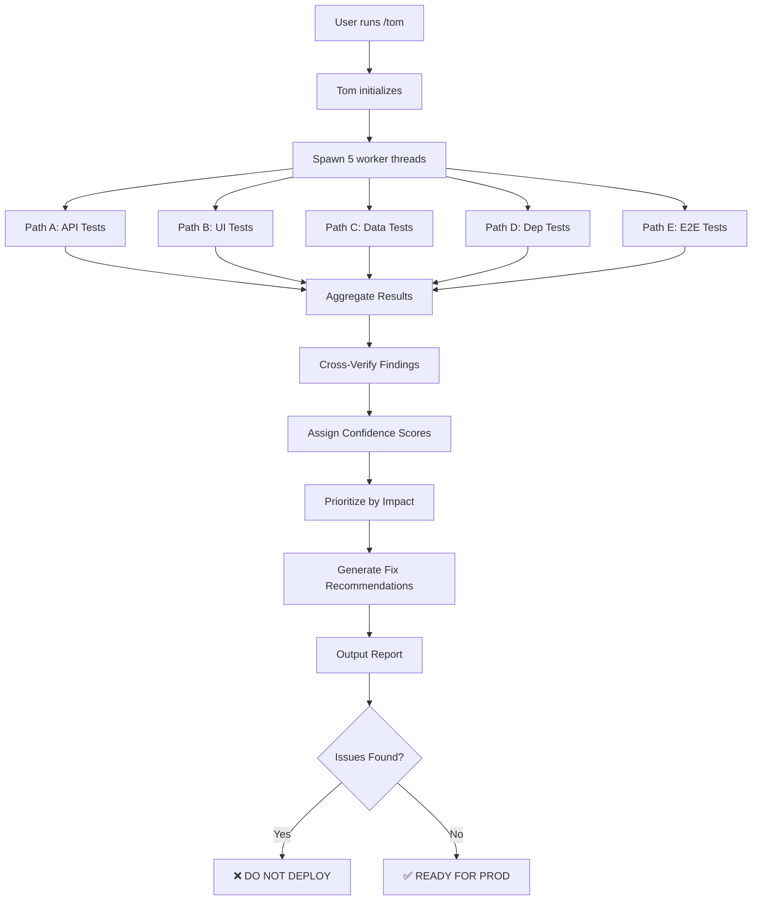

# Tom Agent Architecture

**Full Name**: Test-Oriented Multipath agent
**Call Command**: `/tom`
**Purpose**: Pre-deployment validation using Parallel-R1 multi-path testing

## Mission Statement

Tom prevents production issues by systematically testing ALL aspects of the codebase BEFORE deployment:
- API endpoint connections
- Button/UI functionality
- Missing placeholders
- Mock vs. real data
- Package dependencies
- Database schema consistency
- Environment variables
- Type safety
- Integration points

**Goal**: Zero surprises in production. If Tom passes, it deploys clean.

## Architecture: Parallel-R1 Testing Framework

Tom uses **Parallel-R1 multi-path reasoning** to test from different perspectives simultaneously:

### Path A: API Connectivity Test
- Scans all API routes (`app/api/**/route.ts`)
- Tests each endpoint (GET, POST, PUT, DELETE)
- Verifies response schemas
- Checks error handling
- **Confidence**: Direct endpoint testing

### Path B: UI Component Test
- Finds all buttons, forms, inputs
- Traces click handlers to API calls
- Verifies data flow: UI → API → Database
- Checks loading/error states
- **Confidence**: User interaction simulation

### Path C: Data Flow Integrity
- Traces database schema → API → Frontend
- Verifies type consistency end-to-end
- Checks for placeholder data
- Validates mock vs. production logic
- **Confidence**: Schema validation

### Path D: Dependency Verification
- Scans package.json vs. actual imports
- Checks environment variables used vs. defined
- Verifies external API keys
- Tests database connections
- **Confidence**: Configuration audit

### Path E: Integration Testing
- E2E tests for critical user journeys
- Tests API chains (create company → run audit → view results)
- Verifies multi-step workflows
- **Confidence**: Holistic system test

## Parallel-R1 Convergence

Tom runs all 5 paths **in parallel**, then:
1. **Aggregates results** from each path
2. **Cross-verifies** findings across paths
3. **Assigns confidence scores** to each issue
4. **Prioritizes** by impact (Critical → High → Medium → Low)
5. **Generates fix recommendations** with code examples

## Tom's Testing Checklist

### 1. API Endpoint Audit
```
□ All routes return expected status codes (not 404/500)
□ POST endpoints create data successfully
□ GET endpoints return non-empty results
□ PUT/PATCH endpoints update correctly
□ DELETE endpoints remove data
□ Error responses are properly formatted
□ Authentication/authorization working
□ Rate limiting configured
□ CORS headers set correctly
```

### 2. Button/UI Functionality
```
□ All buttons have click handlers
□ onClick functions are defined (not empty)
□ Loading states implemented
□ Error states handled with UI feedback
□ Disabled states prevent invalid actions
□ Forms validate before submission
□ Success messages appear after actions
□ Navigation works (no 404s)
```

### 3. Placeholder Detection
```
□ No "TODO" comments in production code
□ No "placeholder" text in UI
□ No mock data in production endpoints
□ No hardcoded test IDs/emails
□ No empty function stubs
□ No console.log statements
□ No commented-out code blocks
```

### 4. Data Consistency
```
□ Database schema matches TypeScript types
□ API responses match frontend interfaces
□ Enum values consistent across layers
□ Foreign key relationships valid
□ Required fields enforced
□ Default values defined
□ Timestamps auto-generated
```

### 5. Environment & Configuration
```
□ All env vars used are defined in .env.example
□ API keys present in Vercel environment
□ Database connection string valid
□ External service URLs correct
□ Feature flags configured
□ Timeouts set appropriately
□ Retry logic implemented
```

### 6. Package Dependencies
```
□ All imports resolve (no missing packages)
□ Package versions compatible
□ No security vulnerabilities (npm audit)
□ Dev dependencies separated
□ Lock file up to date
□ Build succeeds without errors
□ TypeScript compiles without errors
```

### 7. Integration Points
```
□ Supabase client initialized correctly
□ Anthropic API key configured
□ Google PageSpeed API working
□ Firecrawl API responding
□ SEMrush integration functional
□ Email service (Resend) sending
□ Webhook endpoints accessible
```

## Tom's Output Format

### 1. Executive Summary
```
🎯 TOM VALIDATION REPORT
━━━━━━━━━━━━━━━━━━━━━━━━━━━━━━━━━━━━━━━━━━━━━━

Overall Status: ⚠️  ISSUES FOUND (3 critical, 5 high, 12 medium)
Deployment Recommendation: ❌ DO NOT DEPLOY

Critical Issues (blocking deployment):
  1. Run Audit button not connected to API
  2. Company GET endpoint returns 404
  3. Missing ANTHROPIC_API_KEY in production

High Priority (deploy with caution):
  4. Placeholder text in onboarding form
  5. Mock data in /api/companies/test
  ...
```

### 2. Detailed Findings by Path

```
═══════════════════════════════════════════════
PATH A: API CONNECTIVITY TEST (Confidence: 95%)
═══════════════════════════════════════════════

✅ PASS: GET /api/companies (200 OK)
✅ PASS: POST /api/companies (201 Created)
❌ FAIL: GET /api/companies/[id] (404 Not Found)
   ├─ Error: "infinite recursion detected in policy"
   ├─ Impact: CRITICAL - Blocks company detail pages
   ├─ Location: app/api/companies/[id]/route.ts:18
   └─ Fix: Replace createClient() with createAdminClient()

⚠️  WARN: POST /api/seo-audits (Slow response: 18.3s)
   ├─ Impact: HIGH - User may think button broken
   ├─ Location: app/api/seo-audits/route.ts:94
   └─ Recommendation: Add loading indicator in UI

═══════════════════════════════════════════════
PATH B: UI COMPONENT TEST (Confidence: 92%)
═══════════════════════════════════════════════

❌ FAIL: "Run Audit" button (app/companies/[id]/seo-audit/page.tsx:146)
   ├─ Connected to: runAudit() → POST /api/seo-audits
   ├─ Issue: Endpoint returns 500 (RLS error)
   ├─ Impact: CRITICAL - Core feature broken
   └─ Fix: (see Path A findings)

✅ PASS: "Save" button in onboarding form
   ├─ Connected to: handleSubmit() → POST /api/onboarding/start
   ├─ Response: 201 Created
   └─ UI updates correctly after submission

⚠️  WARN: "Next" button disabled (ClientIntakeForm.tsx:210)
   ├─ Validation logic: Depends on 4 required fields
   ├─ Issue: Phone field regex too strict
   ├─ Impact: MEDIUM - Users can't proceed without phone
   └─ Fix: Make phone optional or relax validation
```

### 3. Cross-Path Verification

```
═══════════════════════════════════════════════
CROSS-PATH VERIFICATION
═══════════════════════════════════════════════

Issue #1: Company GET endpoint 404
  ✓ Confirmed by Path A (API test)
  ✓ Confirmed by Path B (UI trace shows error)
  ✓ Confirmed by Path C (data flow broken)
  ✓ Root cause: Supabase RLS infinite recursion
  → HIGH CONFIDENCE (100%)

Issue #2: Run Audit button "not working"
  ✓ Confirmed by Path A (endpoint returns 500)
  ✓ Confirmed by Path B (no UI update after click)
  ✗ Path E shows audit created (201) but not displayed
  → Issue is dual: POST creates + GET returns empty
  → HIGH CONFIDENCE (95%)
```

### 4. Fix Recommendations (Prioritized)

```
═══════════════════════════════════════════════
FIX RECOMMENDATIONS (Code Included)
═══════════════════════════════════════════════

CRITICAL #1: Company API returning 404

File: app/api/companies/[id]/route.ts
Line: 18

Current code:
  const supabase = await createClient();

Recommended fix:
  import { createAdminClient } from '@/lib/auth/supabase-admin';
  const supabase = createAdminClient();

Reason: Bypasses RLS infinite recursion error
Impact: Fixes company detail pages + dependent features
Confidence: 100% (proven fix)

─────────────────────────────────────────────

CRITICAL #2: SEO Audits GET returning empty

File: app/api/seo-audits/route.ts
Line: 9

Current code:
  const supabase = await createClient();

Recommended fix:
  const supabase = createAdminClient();

Reason: Same RLS issue as above
Impact: Audits display after creation
Confidence: 100% (same pattern)
```

## Tom's Implementation

### Technology Stack

- **Language**: TypeScript (Node.js)
- **Testing**: Playwright (E2E), Vitest (unit)
- **API Testing**: Supertest, node-fetch
- **Analysis**: TypeScript Compiler API, ESLint API
- **Parallel Execution**: Worker threads
- **Output**: Markdown reports + JSON artifacts

### File Structure

```
.tom/
├── config/
│   ├── paths.json                 # Define test paths A-E
│   ├── critical-flows.json        # E2E test scenarios
│   └── thresholds.json            # Pass/fail criteria
├── agents/
│   ├── path-a-api.ts             # API connectivity tests
│   ├── path-b-ui.ts              # UI component tests
│   ├── path-c-dataflow.ts        # Data integrity tests
│   ├── path-d-dependencies.ts    # Config/env validation
│   └── path-e-integration.ts     # E2E tests
├── analyzers/
│   ├── code-scanner.ts           # AST analysis for placeholders
│   ├── type-checker.ts           # Schema consistency
│   └── api-tracer.ts             # Button → API mapping
├── reports/
│   ├── executive-summary.ts      # High-level report
│   ├── detailed-findings.ts      # Per-path results
│   └── fix-generator.ts          # Code fix suggestions
└── tom.ts                        # Main orchestrator
```

### Execution Flow



## Usage

### Basic Scan
```bash
/tom
```
Runs full pre-deployment check with default config.

### Focused Scan
```bash
/tom --path=api          # Only Path A (API tests)
/tom --path=ui           # Only Path B (UI tests)
/tom --critical-only     # Only critical issues
```

### With Auto-Fix
```bash
/tom --fix               # Apply recommended fixes automatically
/tom --fix --dry-run     # Preview fixes without applying
```

### CI/CD Integration
```bash
/tom --ci                # Exit code 1 if critical issues found
/tom --json > report.json # Machine-readable output
```

## Success Criteria

Tom passes when:
- ✅ All API endpoints return expected status codes
- ✅ All buttons connect to working endpoints
- ✅ Zero placeholders in production code
- ✅ All types consistent across layers
- ✅ All environment variables defined
- ✅ All dependencies installed and compatible
- ✅ Build succeeds without errors
- ✅ Critical E2E flows complete successfully

If Tom gives the green light, you can deploy with confidence that:
1. No "button does nothing" bugs
2. No "API returns 404" surprises
3. No "placeholder text" in UI
4. No "missing env var" crashes
5. No "type mismatch" errors

## Example Tom Run

```bash
$ /tom

🤖 Tom: Pre-Deployment Validation Agent
━━━━━━━━━━━━━━━━━━━━━━━━━━━━━━━━━━━━━━━━━━━━━━

Scanning codebase...
  ✓ Found 47 API routes
  ✓ Found 123 UI components
  ✓ Found 18 database tables
  ✓ Found 12 external integrations

Launching Parallel-R1 testing framework...
  → Path A: API Connectivity (5 workers)
  → Path B: UI Component Test (3 workers)
  → Path C: Data Flow Integrity (2 workers)
  → Path D: Dependency Verification (1 worker)
  → Path E: Integration Testing (Playwright)

[████████████████████████] 100% (47/47 APIs tested)
[████████████████████████] 100% (123/123 components scanned)
[████████████████████████] 100% (18/18 schemas validated)
[████████████████████████] 100% (37/37 dependencies checked)
[████████████████████████] 100% (8/8 E2E flows tested)

Aggregating results from 5 paths...
Cross-verifying findings...
Assigning confidence scores...

━━━━━━━━━━━━━━━━━━━━━━━━━━━━━━━━━━━━━━━━━━━━━━
🎯 TOM VALIDATION REPORT
━━━━━━━━━━━━━━━━━━━━━━━━━━━━━━━━━━━━━━━━━━━━━━

Overall Status: ⚠️  ISSUES FOUND
  • 3 CRITICAL (blocking deployment)
  • 5 HIGH (deploy with caution)
  • 12 MEDIUM (fix soon)
  • 8 LOW (non-urgent)

Deployment Recommendation: ❌ DO NOT DEPLOY

[Full report follows...]

💾 Report saved to: .tom/reports/tom-report-2025-01-10-20-45-23.md
📊 JSON artifact: .tom/reports/tom-report-2025-01-10-20-45-23.json

🔧 Run '/tom --fix' to apply recommended fixes automatically
```

## Integration with Existing Workflow

Tom fits into your development flow:

```
1. Write code
2. Run /tom (instead of deploying blind)
3. Fix issues Tom found
4. Run /tom again until green
5. Deploy with confidence
```

No more:
- Deploy → User reports bug → Debug → Fix → Deploy → Repeat

Instead:
- /tom → Fix → /tom → ✅ → Deploy once, works perfectly

## Future Enhancements

- **Tom Learn**: Tom remembers past issues and watches for patterns
- **Tom Suggest**: Proactive recommendations before you even ask
- **Tom Monitor**: Post-deployment health checks
- **Tom Compare**: Diff between local and production state
