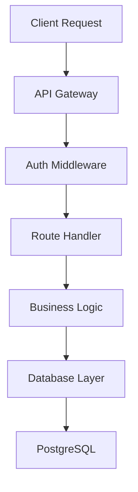

# OpenAI Codex Cloud Documentation

## Overview
OpenAI Codex Cloud is a cloud-based AI coding agent that can read, modify, and run code to help developers build faster, debug issues, and understand complex codebases.

## Core Capabilities
- **Read Code**: Analyze and understand existing codebases
- **Modify Code**: Make changes, refactorings, and improvements
- **Run Code**: Execute code in sandboxed cloud containers
- **Parallel Processing**: Work on multiple tasks simultaneously

## Access Methods

### 1. Web Interface
- URL: https://chatgpt.com/codex
- Full-featured interface
- Interactive conversations
- Direct code execution

### 2. IDE Extension
- Integration with popular IDEs
- In-editor assistance
- Context-aware suggestions
- Seamless workflow

### 3. Mobile (iOS)
- Codex tab in ChatGPT iOS app
- On-the-go code review
- Mobile-optimized interface

### 4. GitHub Integration
- Tag issues/PRs with `@codex`
- Automated code reviews
- PR analysis and suggestions
- Issue triage and resolution

## Authentication & Access

### Requirements
- GitHub account connection (required)
- Multi-factor authentication (mandatory for email/password)
- ChatGPT subscription:
  - Plus ($20/month)
  - Pro ($200/month)
  - Team (custom pricing)
  - Edu (educational pricing)
  - Enterprise (custom pricing)

### Setup Process
1. Connect GitHub account
2. Enable MFA if using email/password
3. Grant repository access permissions
4. Configure workspace settings

## Cloud Environment

### Sandboxed Containers
- **Isolated Execution**: Each task runs in dedicated container
- **Pre-configured**: Automatic dependency installation
- **Secure**: Isolated from production systems
- **Scalable**: Multiple containers for parallel tasks

### Environment Configuration
```json
{
  "runtime": "node-18",
  "dependencies": ["express", "typescript"],
  "environment": {
    "NODE_ENV": "development"
  },
  "resources": {
    "cpu": "2-cores",
    "memory": "4GB"
  }
}
```

### Supported Runtimes
- Node.js (multiple versions)
- Python (2.x, 3.x)
- Go
- Ruby
- Java
- And more...

## Core Features

### 1. Code Refactoring
**Capabilities:**
- Extract functions/methods
- Rename variables consistently
- Simplify complex logic
- Improve code structure

**Example Prompt:**
```
"Refactor the user authentication module to use async/await instead of callbacks"
```

### 2. Architecture Documentation
**Capabilities:**
- Generate system diagrams
- Create architectural overviews
- Document data flows
- Explain component relationships

**Example Prompt:**
```
"Document and create a mermaidjs diagram of the full request flow from the client endpoint to the database."
```

**Example Output:**


### 3. Security Vulnerability Detection
**Capabilities:**
- Scan for common vulnerabilities
- Identify security anti-patterns
- Suggest security improvements
- Check dependency vulnerabilities

**Example Prompt:**
```
"Scan the payment processing module for security vulnerabilities"
```

**Common Checks:**
- SQL injection
- XSS vulnerabilities
- Authentication bypasses
- Insecure dependencies
- Hardcoded secrets

### 4. Code Reviews
**Capabilities:**
- Automated PR reviews
- Best practice enforcement
- Performance suggestions
- Style consistency

**Example Prompt:**
```
"Review this pull request for code quality and potential issues"
```

**Review Criteria:**
- Code quality
- Performance implications
- Security concerns
- Best practices adherence
- Test coverage

### 5. Test Generation
**Capabilities:**
- Unit test generation
- Integration test creation
- Edge case identification
- Test coverage analysis

**Example Prompt:**
```
"Generate comprehensive unit tests for the user service module"
```

**Test Types:**
- Unit tests
- Integration tests
- E2E tests
- Performance tests

### 6. Bug Fixing
**Capabilities:**
- Error diagnosis
- Root cause analysis
- Fix implementation
- Regression prevention

**Example Prompt:**
```
"Find and fix a bug in the authentication package where users can't log in with special characters in their password"
```

**Debugging Process:**
1. Analyze error logs
2. Identify root cause
3. Implement fix
4. Add tests to prevent regression

### 7. UI/Interface Improvements
**Capabilities:**
- Layout fixes
- Responsive design improvements
- Accessibility enhancements
- Component styling

**Example Prompt:**
```
"The modal on our onboarding page isn't centered. Can you fix it?"
```

## Delegation Workflows

### Task Delegation Pattern
1. **Define Task**: Clear, specific instruction
2. **Provide Context**: Relevant files and information
3. **Codex Execution**: AI analyzes and executes
4. **Review Results**: Human verification
5. **Iterate**: Refine as needed

### Multi-Task Parallel Processing
```
Task 1: "Refactor authentication module"
Task 2: "Generate tests for payment service"
Task 3: "Document API endpoints"

Codex processes all three simultaneously in separate containers
```

## Best Practices

### Effective Prompting
1. **Be Specific**: Clear, detailed instructions
   - ❌ "Fix the bug"
   - ✅ "Fix the null pointer exception in UserService.login() when email is undefined"

2. **Provide Context**: Include relevant information
   ```
   "In the Express.js authentication middleware (src/auth/middleware.ts),
   add rate limiting to prevent brute force attacks. Use the existing
   Redis connection for storage."
   ```

3. **Set Constraints**: Define boundaries
   ```
   "Refactor without changing the public API"
   "Maintain backward compatibility"
   "Keep tests passing"
   ```

4. **Request Explanations**: Ask for rationale
   ```
   "Explain why you chose this approach over alternatives"
   ```

### Code Safety
- Review all changes before merging
- Run tests after Codex modifications
- Use version control for rollback
- Start with non-critical tasks

### Performance Optimization
- Batch related tasks
- Use specific file/module references
- Provide clear success criteria
- Limit scope for complex tasks

## Limitations

### Current Constraints
1. **No Browser Rendering**: Cannot visualize web pages
2. **Security Configurations**: Some enterprise setups require admin approval
3. **Repository Access**: Limited to authorized repos
4. **Container Resources**: Time and resource limits on execution

### Workarounds
- Use screenshots for visual feedback
- Work with admins for enterprise setup
- Organize repos for optimal access
- Break large tasks into smaller chunks

## Enterprise Configuration

### Workspace Setup
```json
{
  "organization": "company-name",
  "repositories": ["repo1", "repo2"],
  "permissions": {
    "read": true,
    "write": true,
    "execute": true
  },
  "security": {
    "require_approval": true,
    "allow_secrets": false,
    "sandbox_only": true
  }
}
```

### Admin Requirements
- Workspace configuration
- Repository access grants
- Security policy setup
- User permission management

## Integration Examples

### GitHub Action Integration
```yaml
name: Codex Code Review
on: [pull_request]
jobs:
  codex-review:
    runs-on: ubuntu-latest
    steps:
      - name: Checkout
        uses: actions/checkout@v2
      - name: Trigger Codex Review
        run: |
          gh pr comment ${{ github.event.pull_request.number }} \
            --body "@codex please review this PR"
```

### IDE Integration (VSCode)
```json
{
  "codex.enabled": true,
  "codex.autoReview": true,
  "codex.suggestRefactorings": true,
  "codex.generateTests": true
}
```

### CLI Usage
```bash
# Request code review
codex review --file src/auth.ts

# Generate tests
codex test --module user-service

# Fix bugs
codex fix --issue "null pointer in login"

# Document code
codex document --format mermaid --target architecture
```

## Use Cases

### 1. Rapid Prototyping
```
"Create a REST API for user management with CRUD operations"
```
- Quick scaffolding
- Boilerplate generation
- Working prototypes

### 2. Legacy Code Modernization
```
"Migrate this callback-based code to use async/await"
```
- Pattern updates
- Dependency upgrades
- Architecture improvements

### 3. Documentation Generation
```
"Generate API documentation from this Express routes file"
```
- README creation
- API docs
- Architecture diagrams

### 4. Test Coverage Improvement
```
"Add tests to increase coverage to 80%"
```
- Test generation
- Coverage analysis
- Edge case identification

### 5. Bug Investigation
```
"Why is the memory leak happening in the WebSocket handler?"
```
- Root cause analysis
- Performance profiling
- Memory leak detection

## Pricing & Plans

### Individual Plans
- **Free**: Limited access
- **Plus** ($20/month): Full Codex access
- **Pro** ($200/month): Higher limits, priority access

### Team Plans
- Custom pricing
- Shared workspaces
- Collaborative features
- Admin controls

### Enterprise Plans
- Custom deployment
- Advanced security
- Dedicated support
- SLA guarantees

## Security & Privacy

### Data Handling
- Code analyzed in secure containers
- No long-term storage of proprietary code
- Encrypted transmission
- Access logging

### Best Practices
1. Review generated code for secrets
2. Use environment variables
3. Enable audit logging
4. Regular access reviews

## Comparison with Alternatives

### vs. GitHub Copilot
- **Codex**: Full environment execution, complete tasks
- **Copilot**: Code completion, suggestions

### vs. Local AI Assistants
- **Codex**: Cloud-powered, unlimited resources
- **Local**: Privacy, no internet required

### vs. Human Developers
- **Codex**: Fast, tireless, good for boilerplate
- **Human**: Creative, strategic, complex decisions

## Future Capabilities (Roadmap)

### Planned Features
- Browser rendering support
- More language support
- Enhanced debugging tools
- Deeper IDE integration
- Custom model fine-tuning

## Getting Started Checklist

- [ ] Connect GitHub account
- [ ] Enable MFA
- [ ] Select subscription plan
- [ ] Configure repository access
- [ ] Set up IDE extension (optional)
- [ ] Try first delegation task
- [ ] Review and approve changes
- [ ] Integrate into workflow

## Common Workflows

### Daily Development
```
Morning: "@codex review yesterday's PRs"
During: "Fix this bug while I work on features"
Evening: "@codex generate tests for today's code"
```

### Sprint Planning
```
"Analyze technical debt in authentication module"
"Estimate effort for database migration"
"Document current architecture"
```

### Code Quality
```
"Run security audit on payment processing"
"Check test coverage and generate missing tests"
"Refactor duplicate code across services"
```

## Troubleshooting

### Common Issues

**GitHub Connection Failed**
- Verify OAuth permissions
- Check MFA status
- Re-authenticate

**Container Timeout**
- Break task into smaller chunks
- Optimize execution time
- Request resource increase

**Code Not Executing**
- Check dependency specifications
- Verify runtime compatibility
- Review error logs

## Resources

- **Official Docs**: https://developers.openai.com/codex
- **API Reference**: https://api.openai.com/codex/docs
- **Community**: OpenAI Developer Forum
- **Support**: Enterprise support portal

---
**Source**: https://developers.openai.com/codex/cloud
**Access**: ChatGPT Plus/Pro/Team/Enterprise required
**Last Updated**: 2025-01-03
